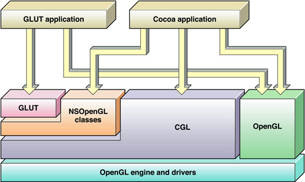

# 背景

在搜 glad，glfw 的作用时，经常会有人概括说：

1. GLFW 是一个专门针对 OpenGL 的 C 语言库,它提供了一些渲染物体所需的最低限度的接口。它允许用户 创建 OpenGL 上下文，定义窗口参数以及处理用户输入。
2. GLAD：由于 OpenGL 驱动版本众多，它大多数函数的位置都无法在编译时确定下来，需要在运行时查询...

<font color="grey">引用自 [glfw 和 glad 有什么区别呢，glad 是用来干什么的（只知道是一个库）？ - coskgid 的回答 - 知乎](https://www.zhihu.com/question/344133077/answer/1161889755)</font>

那么这些总结性的概括，省略了什么东西呢？这里我们以主要 macOS 为例，看一下这两个库做了什么，以及为什么要这样做

# 如果没有三方库，我们应该如何创建一个 OpenGL Context？

以 macOS 为例，在 mac 上，我们通过 cocoa 间接调用到 opengl

<p align="center">
  
  <p>上图来源 <a href="https://developer.apple.com/library/archive/documentation/GraphicsImaging/Conceptual/OpenGL-MacProgGuide/opengl_pg_concepts/opengl_pg_concepts.html">OpenGL on the Mac Platform</a></p>
</p>

[OpenGL on the Mac Platform](https://developer.apple.com/library/archive/documentation/GraphicsImaging/Conceptual/OpenGL-MacProgGuide/opengl_pg_concepts/opengl_pg_concepts.html) 文中的 OpenGL APIs Specific to OS X 节提到：

```
Cocoa provides many classes specifically for OpenGL:

· The NSOpenGLContext class implements a standard OpenGL rendering context.
```

那么 NSOpenGLContext 这个 api 应该就是用来创建 opengl context 的系统 api 了。

果然，在 glfw repo 的 [nsgl_context.m](https://github.com/glfw/glfw/blob/master/src/nsgl_context.m) 的 [326 行](https://github.com/glfw/glfw/blob/master/src/nsgl_context.m#L326) 中找到了调用：

```cpp
    window->context.nsgl.object =
        [[NSOpenGLContext alloc] initWithFormat:window->context.nsgl.pixelFormat
                                   shareContext:share];
```

并且这个 glfw 的 api 名称叫做 `_glfwCreateContextNSGL` 也符合我们的猜测。

类似的，我们也可以找到 glfw 对其他操作系统的封装，可以通过搜索 `_glfwCreateContext` 找到，这里就不列举了。

得益于 Objective-C 和 C/C++ 支持混合编译，glfw 才能够将兼容做在 C++ 侧。

# 如果没有三方库，我们应该如何获取函数指针呢？

当创建好 opengl context 后，glad 通过 `gladLoadGLLoader` 结合 `glfwGetProcAddress` 可以获取 gl 函数的地址：

```cpp
  if (!gladLoadGLLoader((GLADloadproc)glfwGetProcAddress)) {
    std::cout << "Failed to initialize GLAD" << std::endl;
    return -1;
  }
```

所以大家宣称的非常难以找到的 gl 函数指针是怎么被 glad “巧妙地” 获取的呢？

```cpp
int gladLoadGLLoader(GLADloadproc load) {
	GLVersion.major = 0; GLVersion.minor = 0;
	glGetString = (PFNGLGETSTRINGPROC)load("glGetString");
	if(glGetString == NULL) return 0;
	if(glGetString(GL_VERSION) == NULL) return 0;
	find_coreGL();
	load_GL_VERSION_1_0(load);
  // all of load_GL_VERSION_X_X(load);
	load_GL_VERSION_4_6(load);

	if (!find_extensionsGL()) return 0;
	return GLVersion.major != 0 || GLVersion.minor != 0;
}
```

每一个 `load_GL_VERSION_X_X` 都只是调用 `load` 函数，也就是 `glfwGetProcAddress` 将对应的函数调用进行赋值

```cpp
static void load_GL_VERSION_4_6(GLADloadproc load) {
	if(!GLAD_GL_VERSION_4_6) return;
	glad_glSpecializeShader = (PFNGLSPECIALIZESHADERPROC)load("glSpecializeShader");
	glad_glMultiDrawArraysIndirectCount = (PFNGLMULTIDRAWARRAYSINDIRECTCOUNTPROC)load("glMultiDrawArraysIndirectCount");
	glad_glMultiDrawElementsIndirectCount = (PFNGLMULTIDRAWELEMENTSINDIRECTCOUNTPROC)load("glMultiDrawElementsIndirectCount");
	glad_glPolygonOffsetClamp = (PFNGLPOLYGONOFFSETCLAMPPROC)load("glPolygonOffsetClamp");
}
```

嗯，大道至简
