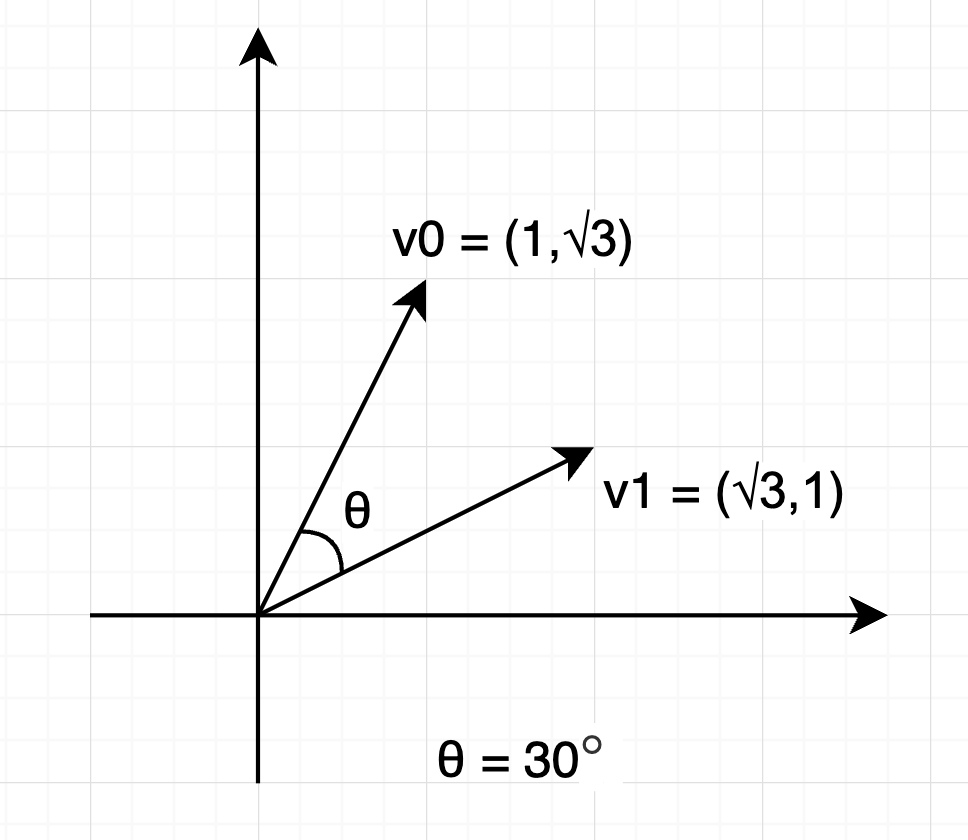
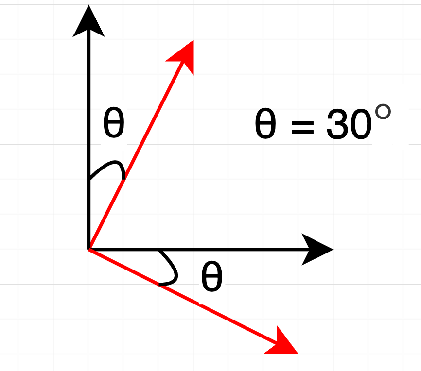
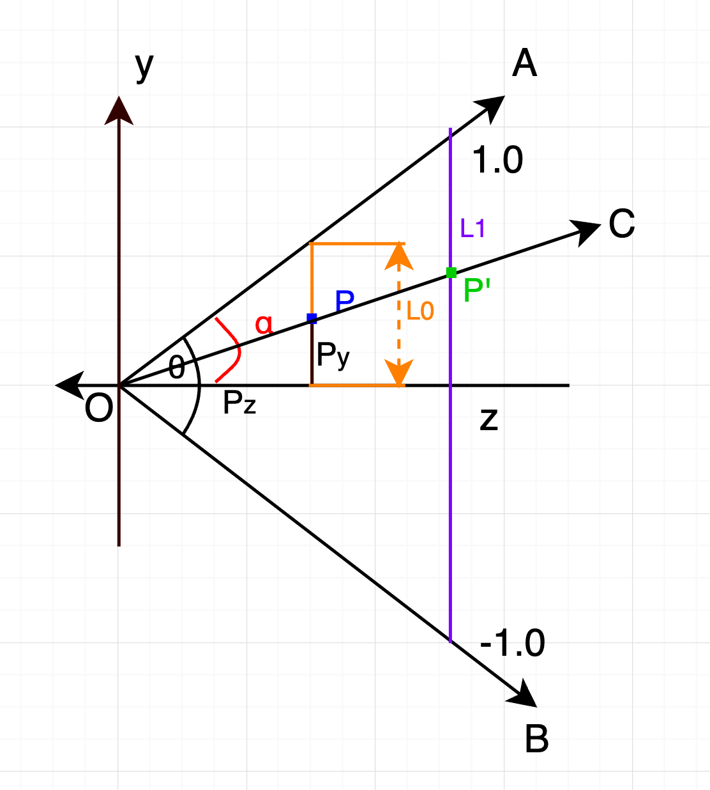
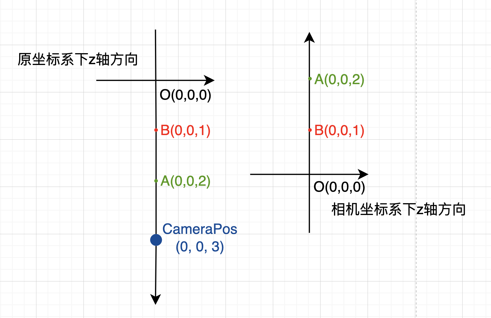
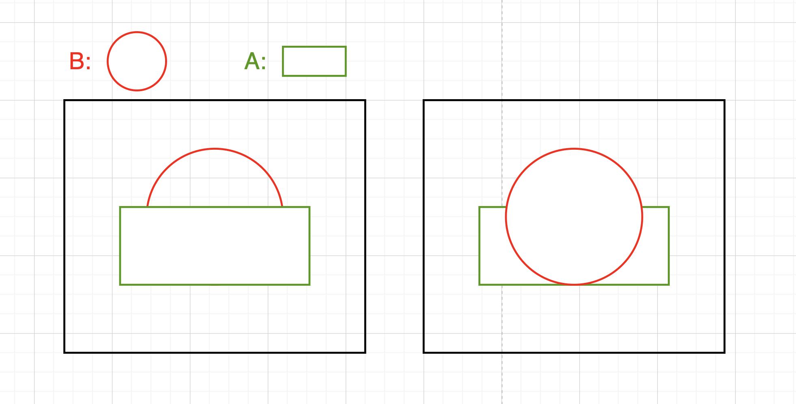

## 旋转矩阵推导理解

在二维笛卡尔坐标系，基向量为 $\vec{v}_x=(1,0)$，$\vec{v}_y=(0,1)$ 的情况下，向量 $\vec{v} = (1,2)$ 的组成如下：

$$
\begin{align}
\vec{v} &= (1,2) \\
&= 1 \cdot \vec{v}_x + 1\cdot\vec{v}_y\\
&= 1 \cdot
\begin{pmatrix}
1\\
0\\
\end{pmatrix} + 2 \cdot \begin{pmatrix}
0\\
1\\
\end{pmatrix} \\
&=
\begin{pmatrix}
1+0\\
0+2\\
\end{pmatrix}\\
&= \begin{pmatrix}
1\\
2\\
\end{pmatrix}
\end{align}
$$

因此旋转（变换）向量的核心就是旋转（变换）基向量。
下面这个例子将 $\vec{v}_0=(1,\sqrt{3})$ 顺时针旋转 $30\degree$ 到 $\vec{v}_1=(\sqrt{3},1)$：

由于本质上旋转的是基向量，如下所示，基向量顺时针旋转 $30\degree$ 之后为

$$
\begin{align}
\vec{v}_{1x}&=
\begin{pmatrix}
1\cdot \cos{\theta}\\
-1\cdot \sin{\theta}\\
\end{pmatrix}\\
&= \begin{pmatrix}
\frac{\sqrt{3}}{2}\\
-\frac{1}{2}\\
\end{pmatrix}\\
\vec{v}_{1y}&=
\begin{pmatrix}
1\cdot \sin{\theta}\\
1\cdot \cos{\theta}\\
\end{pmatrix}\\
&=\begin{pmatrix}
\frac{1}{2}\\
\frac{\sqrt{3}}{2}\\
\end{pmatrix}
\end{align}
$$

因此

$$
\begin{align}
\vec{v}_1 &= 1 \cdot \vec{v}_{1x} + \sqrt{3} \cdot \vec{v}_{1y}\\
&= 1 \cdot
\begin{pmatrix}
\frac{\sqrt{3}}{2}\\
-\frac{1}{2}\\
\end{pmatrix}
 +
\sqrt{3} \cdot
\begin{pmatrix}
\frac{1}{2}\\
\frac{\sqrt{3}}{2}\\
\end{pmatrix}\\
&= \begin{pmatrix}
\frac{\sqrt{3}}{2}+\frac{\sqrt{3}}{2}\\
-\frac{1}{2} + \frac{3}{2}\\
\end{pmatrix}\\
&= \begin{pmatrix}
\sqrt{3}\\
1\\
\end{pmatrix}\\
\end{align}
$$

所以顺时针旋转 2 维向量 $\vec{v} = (x,y)$ 的变换用矩阵形式表示就是：

$$
\begin{bmatrix}
\cos{\theta}&\sin{\theta}\\
-\sin(\theta)&\cos{\theta}
\end{bmatrix}
\cdot
\begin{pmatrix}
x\\
y
\end{pmatrix}
$$

同理可推导 3 维情形。

上述变换还可以理解为，两个坐标系原点重合的情况下，在旋转后的基向量 $\vec{B_x}$ $\vec{B_y}$ 构建的新坐标系下，向量 $\vec{v_B} = (x_B,y_B)$，在原坐标系下的表示。

$$
\vec{v_O}=
\begin{bmatrix}
\vec{B_x}.x&\vec{B_y}.x\\
\vec{B_x}.y&\vec{B_y}.y
\end{bmatrix}
\cdot
\begin{pmatrix}
x_B\\
y_B
\end{pmatrix}
=\begin{pmatrix}
x_O\\
y_O
\end{pmatrix}
$$

$\vec{v_O} = (x_O,y_O)$ 表示旋转变换后的向量在原坐标系下的表示。
这在相机 LookAt 矩阵的推导中起到作用。

## 正交(orthographic)投影矩阵推导理解

正交投影本质上是将给定的 {left, right}, {top, bottom}, {near, far} 这三组 xyz 范围内的坐标，映射到某个三维坐标内（例如映射到 OpenGL 的 [-1, 1] 内）。
这里只演示 1 维度情形下的变换公式。
有以下条件：

1. 目标范围 $R_{aim} = [-1, 1]$
2. 原范围 $R_{orgin} = [0, 10]$
3. 原范围下某点坐标 $P_{origin} = (5)$

在开始计算之前，不妨尝试对现有坐标 $P_{origin}$ 进行定义：
设 $O$ 为点 P 原先所在坐标系的起点，$C$ 为原先 P 所在坐标系的坐标，$S$ 为原先 P 所在坐标系的基向量模长，则 $P_{origin}$ 在基向量模长为 1，起点为 0 的坐标本质上表示为：

$$
P_{origin} = ((C-O) \times \frac{1}{S}\times 1 + 0)
$$

上述公式的步骤可以理解为：

1. $(C-O)$ 计算出 P 点原坐标系下的偏移量
2. $(C-O) \times \frac{1}{S}$ 计算出 P 点的原坐标系下的单位偏移量
3. $(C-O) \times \frac{1}{S} \times 1$ 计算出 P 点在现坐标系下的偏移量
4. $(C-O) \times \frac{1}{S}\times 1 + 0$ 将第三步得到的偏移量从现坐标系的起点开始计算

要解决之前的问题，我们还差一个目标坐标系的基向量长度 $|\vec{b_{aim}}|$，当我们想把 $R_{orgin}$ 用 $R_{aim}$ 表示时，可以理解为 $R_{orgin}$ 需要缩放多少才能变成 $R_{aim}$，因此

$$
\begin{align}
|\vec{b_{aim}}| &= \frac{|R_{aim}|}{|R_{origin}|}\\
&= \frac{1-(-1)}{10-0} \\
&= \frac{1}{5}
\end{align}
$$

带入公式

$$
\begin{align}
P_{aim} &= ((5-0) \times \frac{1}{1}\times \frac{1}{5} + (-1))\\
&= 0
\end{align}
$$

其他坐标轴可以按此来推导

## 透视(perspective)投影矩阵推导

投影矩阵的实例可以在[这里](https://learnwebgl.brown37.net/08_projections/create_perspective/create_perspective.html)把玩。

这里解释 [GLM](https://github.com/g-truc/glm) 语境下的投影矩阵（参数为 fovy, aspect, near, far）。对于 GLM 来说，需要把所有坐标映射到一个 $x\in[-1,1]$，$y\in[-1,1]$，$z\in[near,far]$ 的平面上 near 和 far 由用户指定。[near, far] 映射到 [-1, 1] 的方式比较特殊，这里先探讨 x，y 坐标轴的变换。

### x，y 坐标轴的变换

投影矩阵的核心是比例，以 y 轴计算为例（x 轴相同）：

其中 $\theta$ 是 fovy 角，$\alpha = \frac{\theta}{2}$，如上图所示，投影最终需要计算的是 P' 的 y 坐标。可以看到最后投影出的屏幕 y 坐标范围是 [-1.0, 1.0]，超出这个范围的点会被 OpenGL 进行裁剪。我们需要计算的就是 P' 的 y 坐标。因为相似三角形很容易得出:

$$
P'_y = \frac{P_y}{|L0|} \times 1.0
$$

由于 P 点在视野前方，且我们的视野看向的是 z 轴的负方向，因此 $P_z$ 对我们来说是小于 0 的，所以等式变为：

$$
\begin{align}
P'_y &= \frac{P_y}{|L0|} \times 1.0 \\
&= \frac{P_y}{-P_z\times\tan{\alpha}}
\end{align}
$$

我们发现矩阵中不能处理某个坐标除以其他坐标的情形，不过还好，OpenGL 会在 ndc 中将其他坐标除以 w，因此我们只需要让变换后的 w 等于 $-P_z$ 即可：

$$
\begin{bmatrix}
\frac{1}{\tan{\alpha}}  & 0 & 0 & 0 \\
0 & \frac{1}{\tan{\alpha}} & 0 & 0 \\
0 & 0 & A & B \\
0 & 0 & -1 & 0 \\
\end{bmatrix}
$$

此外，参数中还有一个 aspect 值，一般为宽高比。glm 默认会将宽对齐到高，所以宽一般要除以 aspect。

$$
\begin{bmatrix}
\frac{1}{\tan{\alpha} \times aspect} & 0 & 0 & 0 \\
0 & \frac{1}{tan{\alpha}} & 0 & 0 \\
0 & 0 & A & B \\
0 & 0 & -1 & 0 \\
\end{bmatrix}
$$

最后用 fov 替换 $\alpha$：

$$
\begin{bmatrix}
\frac{1}{\tan{(\frac{fov}{2})} \times aspect} & 0 & 0 & 0 \\
0 & \frac{1}{tan(\frac{fov}{2})} & 0 & 0 \\
0 & 0 & A & B \\
0 & 0 & -1 & 0 \\
\end{bmatrix}
$$

### z 轴变换

接下来，我们还需要将 z 的范围 [near, far] 对应到 ndc 的 [-1, 1]；但是在之前的变换中，我们的 w 会被设置成 -z，所以这里必须要考虑到变换后的 z 在除以 -z 后，它的范围是 [-1, 1]。所以我们就可以得到一个关于 A B 和 z 关系的等式：

$$
\frac{Az+B}{-z}=C\quad(\ z \in [n, f], \quad C \in [-1, 1]\ )
$$

当 z 为 n 时，C 为 -1；z 为 f 时，C 为 1。注意这里的 z 是原坐标系下的 z；n 和 f 则是相机坐标系下的坐标，因此相机坐标系下的 n 和 f 对应到原坐标系下为 -n 和 -f；
因此实际上 z 和 C 的关系为：
当 z 为 -n 时，C 为 -1；z 为 -f 时，C 为 1。
将上述关系带入到等式中，就可以得到方程组：

$$
\begin{cases}
\frac{-Af+B}{f}&=1\\
\frac{-An+B}{n}&=-1\\
\end{cases}
$$

化简得到

$$
\begin{cases}
-A + \frac{B}{f} &= 1 \quad &(1)\\
-A + \frac{B}{n} &= -1 \quad &(2)\\
\end{cases}
$$

由 (1) 可得 A 和 B 的关系：

$$
\begin{align}
-A + \frac{B}{f} &= 1 \\
-A &= 1 - \frac{B}{f} \\
A &=  \frac{B}{f} - 1
\end{align}
$$

代入 (2) 中可得：

$$
\begin{align}
-(\frac{B}{f} - 1) +\frac{B}{n} &= -1\\
1 - \frac{B}{f} + \frac{B}{n} &= -1\\
-\frac{B}{f} + \frac{B}{n} &= -2\\
\frac{B}{f} - \frac{B}{n} &= 2\\
\frac{B(n-f)}{nf} &= 2\\
B&=\frac{2nf}{n-f}
\end{align}
$$

利用等式 (23) 可得

$$
\begin{align}
A &=  \frac{B}{f} - 1\\
A &=  \frac{\frac{2nf}{n-f}}{f} - 1\\
A &=  \frac{2n}{n-f} - 1\\
A &=  \frac{2n-n+f}{n-f}\\
A &=  \frac{n+f}{n-f}\\
\end{align}
$$

由此可得

$$
\begin{cases}
A &= \frac{n+f}{n-f}\\
B &= \frac{2nf}{n-f}
\end{cases}
$$

所以透视投影矩阵为：

$$
\begin{bmatrix}
\frac{1}{\tan{(\frac{fov}{2})} \times aspect} & 0 & 0 & 0 \\
0 & \frac{1}{tan(\frac{fov}{2})} & 0 & 0 \\
0 & 0 & \frac{near+far}{near-far} & \frac{2near \times far}{near-far} \\
0 & 0 & -1 & 0 \\
\end{bmatrix}
$$

透视投影的逆矩阵为：

$$
\left[\begin{matrix}aspect \tan{\left(\frac{fov}{2} \right)} & 0 & 0 & 0\\0 & \tan{\left(\frac{fov}{2} \right)} & 0 & 0\\0 & 0 & 0 & -1\\0 & 0 & \frac{- far + near}{2 far near} & \frac{far + near}{2 far near}\end{matrix}\right]
$$

## 相机 LookAt 矩阵

LookAt 矩阵的推导分为三步：

1. 由相机位置 $P$ 和相机看向的位置 $O$ 计算出相机坐标系下的 z 轴，正方向由相机 $P$ 指向 $O$
2. 由第 1 步得到的 z 轴，和 up 向量 (0.0, 1.0, 0.0) 计算相机坐标系的 x 轴，因为要使的看到的图像和原坐标系下显示的左右上下一致，因此正方向和原坐标系下的一致
3. 由 1，2 步得到的 z，x 向量叉乘得到 y 轴（因为叉乘的四边形面积的几何意义 $|a||b||sin\theta|$，这一步无需进行 normalize）
4. 将 z 轴反向，这是因为当原坐标系下的前后关系，会在 $\vec{PO}$ 方向上相反，如下图所示：

当 B 是圆面片，A 是长方形面片时，左侧为相机应当看到的画面，右侧为相机坐标系下看到的画面

5. 将原坐标系下的顶点坐标在相机坐标系下进行表示

由于我们需要构建相机坐标系，因此 1，2，3 得到的坐标系均为标准化后的坐标，分别按照 123 的步骤进行计算即可。重点在第四步，我们引入旋转矩阵推导理解最后的结论：

> 两个坐标系原点重合的情况下，在旋转后的基向量 $\vec{B_x}$ $\vec{B_y}$ 构建的新坐标系下，向量 $\vec{v_B} = (x_B,y_B)$，在原坐标系下的表示。

$$
\vec{v_O}=
\begin{bmatrix}
\vec{B_x}.x&\vec{B_y}.x\\
\vec{B_x}.y&\vec{B_y}.y
\end{bmatrix}
\cdot
\begin{pmatrix}
x_B\\
y_B
\end{pmatrix}
=\begin{pmatrix}
x_O\\
y_O
\end{pmatrix}
$$

$\vec{v_O} = (x_O,y_O)$ 表示旋转变换后的向量在原坐标系下的表示。

可知，若想把原坐标系下的向量 $\vec{v_O}$ 转换为旋转后坐标系下的向量 $\vec{v_B}$，只需要进行矩阵的逆运算即可：

$$
\begin{align}
\vec{v_B}&=
\begin{bmatrix}
\vec{B_x}.x&\vec{B_y}.x\\
\vec{B_x}.y&\vec{B_y}.y
\end{bmatrix}
^{-1}
\cdot
\begin{pmatrix}
x_O\\
y_O
\end{pmatrix}\\
&=
\begin{bmatrix}
\vec{B_x}.x&\vec{B_x}.y\\
\vec{B_y}.x&\vec{B_y}.y
\end{bmatrix} \cdot
\begin{pmatrix}
x_O\\
y_O
\end{pmatrix}\\
&=\begin{pmatrix}
x_B\\
y_B
\end{pmatrix}
\end{align}
$$

因此，假设我们得到了相机坐标系的基向量 $\vec{B_x}$，$\vec{B_y}$，$\vec{B_z}$ 后，若想把原坐标系下的顶点 $\vec{v_O}$ 表示到相机坐标系下，可以应用变换：

$$
\begin{bmatrix}
B_x.x&B_x.y&B_x.z&0\\
B_y.x&B_y.y&B_y.z&0\\
B_z.x&B_z.y&B_z.z&0\\
0&0&0&1
\end{bmatrix}
\cdot \vec{v_O}
$$

注意，上述变换是在相机坐标系原点和原坐标系原点重合的情况下进行的，若不重合，则需要先进行 translate 的变换：

$$
\begin{bmatrix}
0&0&0&-camera\_pos.x\\
0&0&0&-camera\_pos.y\\
0&0&0&-camera\_pos.z\\
0&0&0&1
\end{bmatrix}
\cdot \vec{v_O}
$$
