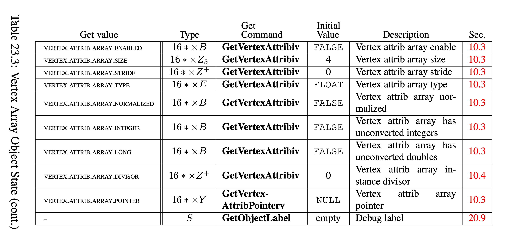
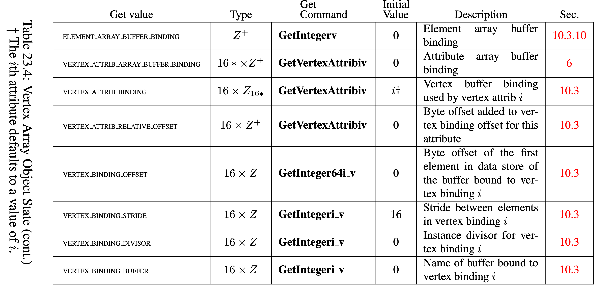

# OpenGL VAO 

1. VAO 状态表
   
   
2. 从 GL4.3 新增 ARB_vertex_attrib_binding 之后，vertex object 内部分成了 vertex attribute 以及 vertex buffer binding point 两部分，并且 VERTEX_ATTRIB_ARRAY_STRIDE 与 VERTEX_BINDING_STRIDE 相同[1]。关于 VAO 的结构可以参考 VertexArrayObject.drawio
3. 关于 VAO 状态表格中出现的 VERTEX_ATTRIB_ARRAY_DIVISOR 与 VERTEX_BINDING_DIVISOR，由于 4.3 之后使用了 ARB_vertex_attrib_binding，因此 4.3 之后，VertexAttribDivisor 的行为与先后调用 VertexAttribBinding 和 VertexBindingDivisor 一致[2][3]：
   > The command void VertexAttribDivisor( uint index, uint divisor ); is equivalent to (assuming no errors are generated):
   > VertexAttribBinding(index, index);
   > VertexBindingDivisor(index, divisor);

## Reference

1. glspec46.core.pdf page 358 following `"They are equivalent (assuming no errors are generated) to:"`
2. https://stackoverflow.com/a/50651756/14419237
3. glsepc46.core.pdf page 360 `"The command
void VertexAttribDivisor( uint index, uint divisor );
is equivalent to (assuming no errors are generated):
VertexAttribBinding(index, index); VertexBindingDivisor(index, divisor);"`
