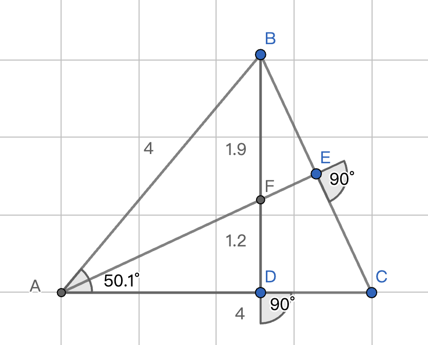
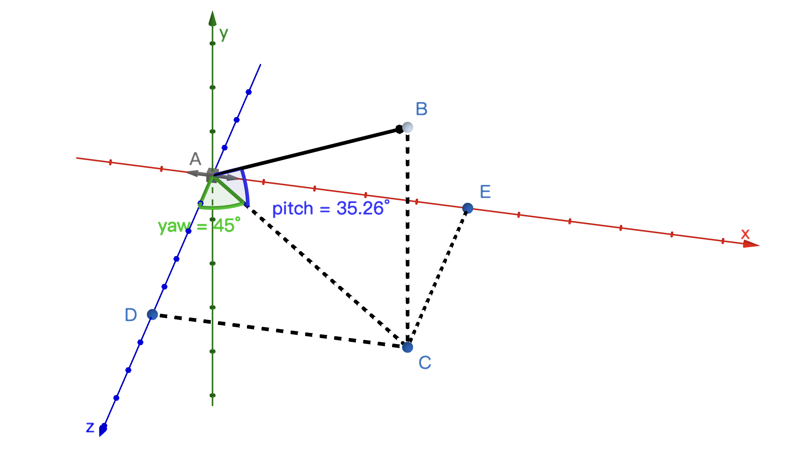

# 相机视角的计算方式

## 为什么鼠标移动的距离被当作俯仰角？

### 背景

我在写 ICViewer 的测试工程时，尝试按照自己的思路完成了一个相机。我的思路是这样的：

1. 获取鼠标移动的距离

2. 获取窗口的尺寸

3. 通过鼠标移动的距离和窗口尺寸做 ratio

4. 将这个 ratio 乘以相机的 fov，得到实际移动的角度

5. 通过这个角度（通过 glm::ratate 接口）来旋转 lookat（cameraFront）向量，以此改变相机的朝向。
   （上面这个思路不正确！）

写完之后，我认为通过（鼠标移动的距离）/（窗口尺寸）\*（相机 fov）的方式计算旋转角度，非常直观，测试的时候（800x600 窗口， fov=$45\degree$） 。

然后对照了一下 [LearnOpenGL-Camera](https://learnopengl.com/Getting-started/Camera) 中的计算方式，发现计算过程高效且易懂。（第 n 次）阅读之后，对鼠标移动的距离直接用作角度的方式，仍然很不理解。如果直接将鼠标移动的距离与角度对应起来，那么会发现这个比例完全不合理：

<p align="center">

</p>
我们假设角BAC为最大俯仰角，当鼠标在屏幕上移动 FD 的距离时，并没有到达 BD 的一半。由于我认为这样计算存在移动距离和角度不成比例的问题，所以单纯地将鼠标移动的距离当作角度进行计算，并不能说服我自己认同这个方法。

## 之前的思路为什么错了

1. 与我的方法不同，LearnOpenGL 甚至没有计算鼠标移动距离所占屏幕尺寸的比例，仔细思考后发现，如果鼠标灵敏度不变的情况下，将窗口尺寸变大，那么同样的角度，改大窗口尺寸后，需要将鼠标移动到更远的距离才能达到。

2. 相机可以看作一个 position 向量加一个 lookat(cameraFront) 向量。因为后者是一个单位向量，所以我们可以使用下面这个方式来描述它：
   令 yaw 为向量 lookat(x, y, z) 与平面 z=0 夹角的角度，令 pitch 为向量 lookat(x, y, z) 与平面 y=0 夹角的角度：

<p align="center">

</p>

$$
\begin{align}
x &= cos(pitch) * sin(yaw) \\
y &= sin(pitch) \\
z &= cos(pitch) * cos(yaw)\\
\end{align}
$$

## 尝试改进之前的方法

通过之前的错误分析，我们可以明确两个目标：

1. 使用一个固定的屏幕尺寸来避免窗口尺寸对视角移动的影响。
2. 根据之前的结论计算单位向量

### 1. 固定尺寸的确定

我们假设固定尺寸为 x_fix 和 y_fix，鼠标移动的距离为 x_offset 和 y_offset，最大俯仰角度为正负 90 度。那么为了让鼠标移动的距离与视角旋转的角度成比例，我们的最终角度 final_degree 应该通过如下计算获得：

$$
final\_degree = \frac{y_{offset}}{y_{fix/2}} * 90\degree
$$

这里的重点其实并不在于 90 度，而是我们通过 $ \frac{y_{offset}}{y_{fix/2}} $ 的方式，构建了一个可以 1 度与鼠标位移的线性关系，这意味着移动固定的鼠标距离就可以增加固定的移动角度。因此，当 $y\_fix/2$ 为 90 度时，final_degree 就变成了 y_offset；那么当最大俯仰角度为正负 89 度，当 $y\_fix/2$ 为 89 度时，这套算法就和 LearnOpenGL 的算法一致了。

### 2. 计算 lookat(cameraFront) 单位向量

根据之前的结论：

$$
\begin{align}
x &= cos(pitch) * sin(yaw) \\
y &= sin(pitch) \\
z &= cos(pitch) * cos(yaw)\\
\end{align}
$$

计算时，我们发现当 yaw 和 pitch 为 0 时，得到的单位向量初始值为 (0, 0, 1)，而我们的相机默认朝向为 (0, 0, -1)，因此我们要做的就是将 z 轴旋转 180 度：

$$
\begin{align}
x &= cos(pitch) * sin(yaw) \\
y &= sin(pitch) \\
z &= cos(pitch) * cos(yaw + 180\degree)\\
\end{align}
$$

但这与 LearnOpenGL 的结论看起来完全不一样：

```cpp
float yaw   = -90.0f;
float pitch =  0.0f;
...
void mouse_callback(GLFWwindow* window, double xposIn, double yposIn)
{
...
    glm::vec3 front;
    front.x = cos(glm::radians(yaw)) * cos(glm::radians(pitch));
    front.y = sin(glm::radians(pitch));
    front.z = sin(glm::radians(yaw)) * cos(glm::radians(pitch));
    cameraFront = glm::normalize(front);
}
```

其实这里只要简单做一个三角变换就好：

$$
\begin{align}
sin(yaw) &= cos(yaw - 90)\\
cos(yaw + 180) &= sin(yaw - 90)
\end{align}
$$
