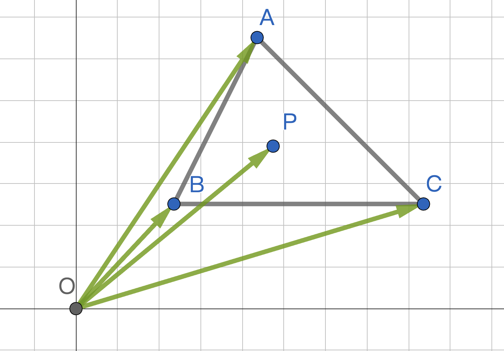
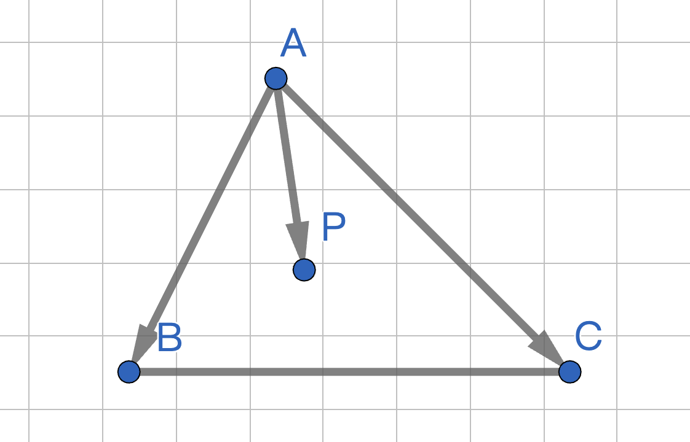
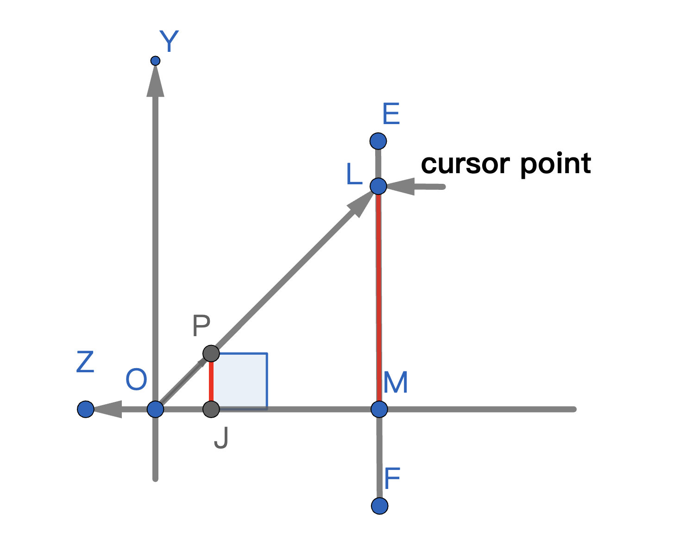
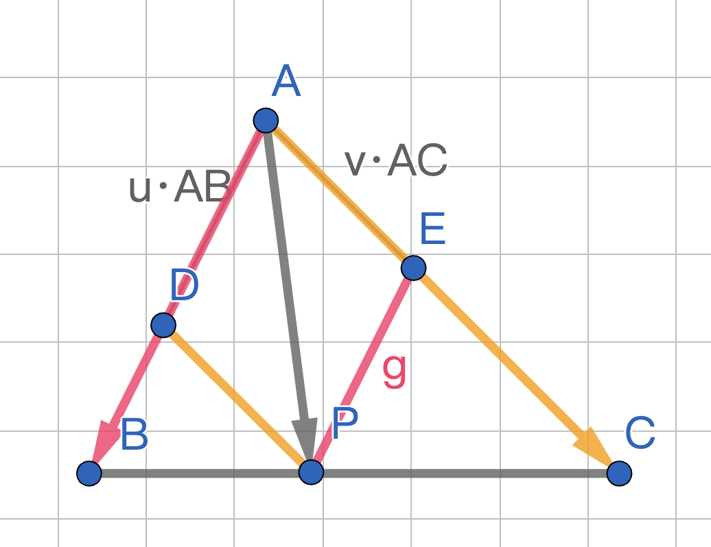

[toc]

# Ray Caster

## 背景

ICVp 的一个需求是鼠标可以通过左键点击模型，这个操作可以通过射线交叉计算来实现，大致分为几个步骤：

1. 获取屏幕中的鼠标位置
2. 计算摄像机到鼠标位置的方向向量，起点为摄像机
3. 计算射线是否击中模型的某个三角形片面

显然第三个步骤是解决问题的关键。击中这个词语还不太准确，我们其实想要计算的是，判断三维射线是否处于空间三角形内部。

## 射线处于三角形内部的条件

初中物理学过，两个分力会产生一个合力。向量也是如此，且射线在某个时刻的终点也可以使用一个坐标点来表示，因此我们可以将上述问题简化为“判断二维坐标点是否处于平面三角形内部”。

假设有 O，A，B，C，P 四个坐标点，O 为二维坐标轴中心，P 在 坐标 A，B，C 三点围成的三角形中心：

<div style="text-align: center">

</div>

方便起见，下面只保留 A，B，C，P。

首先，如果 P 点在 $ \triangle{ABC}$ 内，则 P 满足 $\vec{AP} = u \vec{AB} + v \vec{AC}$，且满足以下条件：

$$
\begin{cases}
0 \leq & u &\leq 1 \\
0 \leq & v &\leq 1 \\
0 \leq & u + v &\leq 1 \\
\end{cases}
$$

上述条件的证明过程在<a href="#pf1">这里</a>。

如下图所示：

<div style="text-align: center">

</div><br>

由 $\vec{AP} = u \vec{AB} + v \vec{AC}$ 可得：

$$
\begin{align}
\vec{AP} &= u \vec{AB} + v \vec{AC}\\
P - A &= (B - A)u + (C - A)v\\
P &= (B - A)u + (C - A)v + A\\
P &= (1-u-v)A + uB + vC
\end{align}
$$

## 三维情形

现在我们有一个摄像机 O，一个摄像机到鼠标方向的方向向量 $\vec{D}$（单位向量），以及时间 t，那么由摄像机为起点，沿着方向向量 $\vec{D}$ 射出的射线，其终点坐标 P 的表达式为：

$$ P = O + \vec{D}t $$

由于之前的结论适用于三维情形，因此我们要做的只是判断射线在某个时间点 t 的终点是否落在三角形内，因此我们可以直接将 $ P = O + \vec{D}t $ 代入之前的公式中：

$$
\begin{align}
P &= (1-u-v)A + uB + vC\\
O + \vec{D}t &= (1-u-v)A + uB + vC\\
\end{align}
$$

由于我们最终要求的是 t，u，v 三个变量，因此我们变换一下等式，将 t，u，v 放在一起

$$
\begin{align}
O + \vec{D}t &= (1-u-v)A + uB + vC\\
O + \vec{D}t &= (B - A)u + (C - A)v + A\\
O - A &= (B - A)u + (C - A)v - \vec{D}t\\
O - A &=
\begin{bmatrix}
(B-A) & (C-A) & -D
\end{bmatrix}
\begin{pmatrix}
u\\
v\\
t
\end{pmatrix}
\end{align}
$$

当 t，u，v 满足以下条件时，说明射线在三角形内部：

$$
\begin{cases}
0 \leq & u &\leq 1 \\
0 \leq & v &\leq 1 \\
0 \leq & u + v &\leq 1 \\
0 \leq & t
\end{cases}
$$

## Coding time

知道了原理之后，就实践一下看看吧。这里预计实现一个场景，具有以下功能

1. 能在场景中移动
2. 能在场景中观察
3. 能场景中渲染一个立方体
4. 能在不同的位置上选中立方体

### 1. 所需要的数据

这里再列一下刚才的公式：

$$
\begin{align}
O + \vec{D}t &= (1-u-v)A + uB + vC\\
\end{align}
$$

其中：

1. O 为相机位置
2. D 为射线方向
3. A，B，C 分别是三角形的三个顶点

化简公式之后，得到：

$$
\begin{align}
O - A &=
\begin{bmatrix}
(B-A) & (C-A) & -D
\end{bmatrix}
\begin{pmatrix}
u\\
v\\
t
\end{pmatrix}
\end{align}
$$

因此，我们也需要计算以下数据：

1. $\vec{AO} = O - A$
2. $\vec{AB} = B - A$
3. $\vec{AC} = C - A$
4. -$\vec{D}$

### 2. 构建场景

回顾一下之前的需求：

1. 能在场景中移动
2. 能在场景中观察
3. 能场景中渲染一个立方体
4. 能在不同的位置上选中立方体

可以发现构建这样一个场景需要实现：

1. 摄像机
2. 立方体
3. ray caster

除了 ray caster 之外，其他的可参考其他教程

### 3. 实现 ray caster

#### 1. ray caster 对象

我们的 ray caster 具有以下属性：

1. 对一组要进行 model 的引用
2. 对一个摄像机的引用
3. 一个光线方向

以及以下方法：

1. 新增相机对象
2. 获取各个属性的方法

```cpp
class RayCaster {
public:
  RayCaster(const glm::vec3 &direction = glm::vec3(0.0, 0.0, -1.0));

  void set_camera_ref(const std::shared_ptr<Camera> camera);
  const std::weak_ptr<Camera> &camera_ref() const;

  void AddModelRef(const std::shared_ptr<Model> &model);

  std::vector<std::weak_ptr<Model>> model_ref_vec();

  glm::vec3 direction() const;

private:
  std::weak_ptr<Camera> camera_ref_;
  std::vector<std::weak_ptr<Model>> model_ref_vec_;
  glm::vec3 direction_;
};
```

#### 2. 处理 ray caster 过程

> 注：这里仅适用于场景中有一个立方体，且没有经过优化的算法。
> 多个模型场景也可以参考 threejs 的 [RayCaster.js](https://github.com/mrdoob/three.js/blob/dev/src/core/Raycaster.js) 中的实现方法。可能是以下步骤：
>
> 1. 计算模型包围框
> 2. 计算模型 中心/重心/某个三角形面片 与相机的距离
> 3. 找到距离相机最近的模型
> 4. 计算距离相机最近的三角形面片内部是否被射线命中

进一步细化选中立方体的过程：

1. 获取鼠标的窗口坐标
2. 转换鼠标坐标到 ndc：
   - x 从左到右 $\in$ [-1, 1]
   - y 从上到下 $\in$ [-1, 1]
3. 使用转换好的鼠标坐标构造一个射线 D = (x, y, z, 1.0)
4. 将射线 D 转换到世界空间内（依次乘以 projection 和 view 的逆矩阵）
5. 将射线 D 赋值为 D - camera_pos（view 逆矩阵会带一个 camera 位移，需要处理一下来应用公式中 camera_pos + Dt 的部分）
6. 将 D 代入公式，对等式两边乘以逆矩阵求解

接下来每一节都对之前的步骤进行详细描述（有些步骤会合并）

##### 1. 获取鼠标坐标

glfw 库下，通过下面的几个 API 来获取：

```cpp
glm::dvec2 cursor_pos;
glfwGetCursorPos(window, &cursor_pos.x, &cursor_pos.y);
```

由于使用 glfw，所以窗口的原点（0, 0）默认是在左上角，所以我们以 width 为例，将其表示为 ndc 时，所做的变换如下：

$$
\begin{align}
[0, width] - \frac{width}{2} &= [-\frac{width}{2}, \frac{width}{2}]\\
[-\frac{width}{2}, \frac{width}{2}] - \frac{width}{2} &= [-1, 1]
\end{align}
$$

##### 2. 构造射线

有了鼠标坐标，我们就可以构造一个射线传播的方向 $D = (x, y, z, 1.0)$，这里的 x 和 y 来自于鼠标的 ndc 坐标。对于 z 和 w 的取值稍微有点复杂，我们详细说明。

- **z 的取值**
  我们鼠标点击后形成的射线，应当是在相机视角下的投影空间中产生的，为了与未经变换的立方体坐标进行计算，要依次乘以投影矩阵和视角矩阵的逆矩阵。然而投影矩阵（perspective）的逆矩阵比较特殊：
  $$
  \left[\begin{matrix}aspect \tan{\left(\frac{fov}{2} \right)} & 0 & 0 & 0\\0 & \tan{\left(\frac{fov}{2} \right)} & 0 & 0\\0 & 0 & 0 & -1\\0 & 0 & \frac{- far + near}{2 far near} & \frac{far + near}{2 far near}\end{matrix}\right]
  $$
  通过观察可以发现，逆矩阵对向量进行变换之后，向量的 z 轴等于 -w。如果回忆一下 perspective 投影矩阵：
  $$
  \begin{bmatrix}
  \frac{1}{\tan{(\frac{fov}{2})} \times aspect} & 0 & 0 & 0 \\
  0 & \frac{1}{tan(\frac{fov}{2})} & 0 & 0 \\
  0 & 0 & \frac{near+far}{near-far} & \frac{2near \times far}{near-far} \\
  0 & 0 & -1 & 0 \\
  \end{bmatrix}
  $$
  就会发现，投影矩阵对向量做变换之后，向量的 w 分量等于 -z（原因不展开说明，请参考投影矩阵笔记）。因此这里我们可以使用任何的 z 值。
- **w 的取值**
  之前讨论 z 的取值时，我们发现 w 的在逆矩阵变换后，会计算出 -z。那么为什么这里要用 1.0 呢？（请抛开<font color="red">惯例</font>这个原因）
  我们回忆一下坐标经过投影矩阵变换之后，如何显示在屏幕上。首先坐标经过视角矩阵投影变换，变换后的 xyzw 四维坐标，其 w 分量为 -z，之后 OpenGL 内部会将其他 xyz 值分别除以 w，也就是 -z。
  现在，我们有屏幕上的坐标 （x, y, z, w），w 为 -z，要还原回应用投影坐标之前，我们应当先实行如下操作：

  1. 对坐标 xyz 乘以 w：(x, y, z) \* w
  2. 对坐标应用逆矩阵 inverse_perspective_projection_matrix \* (xw, yw, zw, w)

  此时，若 w 为 1.0， 我们就无需额外的计算，直接可以对 (x, y, z, w) 应用逆矩阵。因此我们的方向向量。

- **逆变换过程发生了什么**
现在，我们的方向向量定义为 (cursor_x, cursor_y, z, 1.0)，这意味着应用逆变换之后，我们的向量会变成 (x, y, 1.0)。由于我们的射线，是以相机位置 O 为起点，O + D\*t 为终点，如何保证逆变换之后的 (x, y, 1.0) 一定与场景中的三角形有交点呢？
如下图：
<div style="text-align: center">
  
</div>
立方体的面 PJ，应用投影矩阵后，在屏幕 EM 处的投影为 LM。若 LM 逆变换后得到线段 PJ，则光标点击位置 L，给定 x，y，w 坐标，逆变换之后的方向，一定与 OP 向量的方向一致。

因此，我们可以明确射线的坐标：

```cpp
  glm::vec3 O = camera.position();
  glm::vec3 D = glm::vec3(trans_cursor_pos,
                          -0.1);
  D = camera.inverse_projection_mat() * glm::vec4(D, 1.0);
  D = camera.inverse_view_mat() * glm::vec4(D, 1.0);
  D = D - O;
  D = glm::normalize(D);
```

##### 3. 代入公式求解

这里就非常简单了，再次搬出之前的公式，并且附上代码：

$$
\begin{align}
O - A &=
\begin{bmatrix}
(B-A) & (C-A) & -D
\end{bmatrix}
\begin{pmatrix}
u\\
v\\
t
\end{pmatrix}
\end{align}
$$

我们用下述变量代替上述部分减法

1. $\vec{AO} = O - A$
2. $\vec{AB} = B - A$
3. $\vec{AC} = C - A$
4. -$\vec{D}$

当 t，u，v 满足以下条件时，说明射线在三角形内部：

$$
\begin{cases}
0 \leq & u &\leq 1 \\
0 \leq & v &\leq 1 \\
0 \leq & u + v &\leq 1 \\
0 \leq & t
\end{cases}
$$

代码为：

```cpp
  glm::vec3 A = model->GetPointPositionByIdx(0);
  glm::vec3 B = model->GetPointPositionByIdx(1);
  glm::vec3 C = model->GetPointPositionByIdx(2);

  glm::vec3 AB = B - A;
  glm::vec3 AC = C - A;
  glm::vec3 AO = O - A;

  //                      [u]
  // O-A = [B-A C-A -D] * |v|
  //                      [t]
  //            ^(-1)          [u]
  // [B-A C-A -D]      * O-A = |v|
  //                           [t]
  glm::mat3 inverse_mat = glm::inverse(glm::mat3(AB, AC, -D));
  glm::vec3 uvt = inverse_mat * AO;
  float u = uvt.x;
  float v = uvt.y;
  float t = uvt.z;
  float u_v = u + v;

  if (0 <= u && u <= 1 &&
      0 <= v && v <= 1 &&
      0 <= u_v && u_v <= 1 &&
      0 <= t) {
    aimed_models.push_back(model);
  }
```

# 证明

## 证明 1

<text id = "pf1">已知</text>点 P 为 $\triangle{ABC}$ 内一点，且向量 $\vec{AP} = u \vec{AB} + v \vec{AC}$，

<div style="text-align: center">

</div>
证明：

$$
\begin{cases}
0 \leq & u &\leq 1 \\
0 \leq & v &\leq 1 \\
0 \leq & u + v &\leq 1 \\
\end{cases}
$$

由 $\vec{AP}$ 模长可知：

1. 当 P 在 BC 边上时，u+v 的值最大
2. 由于 P 在三角形内部，所以 u，v 最小为 0，最大为 1

上述结论可以证明：

$$
\begin{cases}
0 \leq & u &\leq 1 \\
0 \leq & v &\leq 1 \\
0 \leq & u + v \\
\end{cases}
$$

下面证明 $ u + v \leq 1$：

设 D 为 AB 上一点，E 为 AC 上一点，AD = u\*AB，AE = v\*AC，DB = (1-u)\*AB，EC = (1-v)\*AC，且满足：

1. $DP\parallel{AC}$
2. $EP\parallel{AB}$

线段 AD 长度为 u 倍的 AB，线段 AE 长度为 v 倍的 AC：

<div style="text-align: center">

</div>

因为 $DP\parallel{AC} $ 且 $EP\parallel{AB}$，所以有：

$$
\begin{cases}
&\angle{BDP} = \angle{BAC} = \angle{PEC} \\
&\angle{DBP} = \angle{EPC}\\
\end{cases}
$$

所以 $\triangle{BDP}$ 和 $\triangle{PEC}$ 是相似三角形。因此可得等式：

$$
\begin{align}
\frac{DB}{EP} &= \frac{DP}{EC}\\
\frac{(1-u)*AB}{u*AB} &= \frac{v*AC}{(1-v)*AC}\\
\frac{(1-u)}{u} &= \frac{v}{(1-v)}\\
(1-u)(1-v)  &= uv\\
1-v-u+uv &= uv\\
u+v &= 1
\end{align}
$$

证毕
