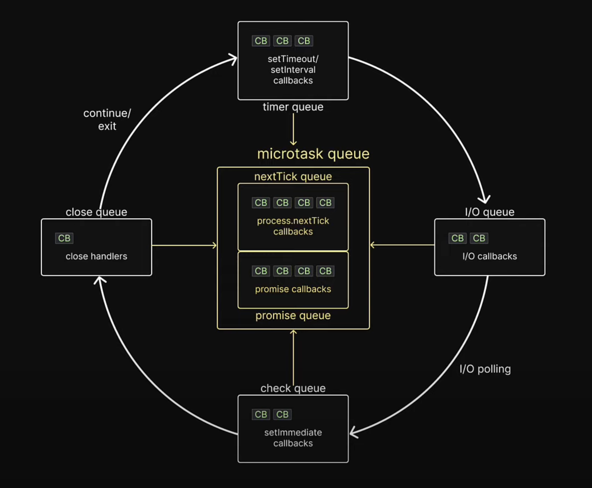

# Event Loop of libuv

由于 libuv 的 event loop 官方描述中，共分为 13 个阶段，很难记忆，所以这里简单划分为以下 4 个阶段

1. 初始化
2. 准备阶段
3. I/O 阶段
4. 结束阶段

## 1. 初始化

1. 设置 now 时间戳
2. 检查 due handle 中是否有超过此时间戳的 handle，若有，则触发该 handle 的 callback

## 2. 准备阶段

1. 检查 loop 是否存活
2. 检查 pending queue 是否有任务需要执行（pending queue 存放一些 i/o 阶段没能执行的 callback）
3. 检查 idle queue 是否有任务需要执行
4. 检查 prepare queue 是否有任务需要执行

## 3. I/O 阶段

1. 根据一些条件，计算 I/O 阶段需要 blocking 的时间
2. 根据确定的 blocking 时间，执行各平台的 poll 操作
3. 所有和文件描述符读写操作相关联的 handle，其 callback 大多都会在这个阶段触发（没有触发的会加入到 pending queue 中）

## 4. 结束阶段

1. Poll 阻塞完成后，检查 check queue 中是否有任务需要执行
2. 若有 handle 被 uv_close 处理，则调用其 close handle
3. 更新 now 时间戳
4. 执行超时的 due timer
5. 若 UV_RUN_NOWAIT 或者 UV_RUN_ONCE，则结束循环；若 UV_RUN_DEFAULT，则回到初始化阶段

# 来自其他资源的补充

## event loop 模型

### 简化 I/O 队列

要理解 libuv 的运作机制，可以通过下面这个图来理解：

  

[（可以参阅这个视频）](https://www.bilibili.com/video/BV1Rw411s7wT/?p=42&share_source=copy_web&vd_source=7122811f33b9804864bfad38c3aaa539&t=637)

简单来说，异步代码的执行顺序符合一下几条原则：

1. 用户代码优先于所有异步代码
2. microtask queue 内部的 callback 函数优先被执行
   - nextTick 优先于 promise 被执行
3. 外层队列按照 timer -> I/O -> check -> close 的顺序执行
4. timer，I/O，check，close 中的每个 callback 执行完后，都会检查一下 microtask queue，若 microtask queue 中存在任务，则执行完成后，再执行下一个 timer，I/O，check，close 中的任务
5. timer，I/O，check，close 之间切换时，也会检查一下 microtask queue 内是否存在没有执行完的任务，若存在，则执行。

### 详细队列

此时如果对比 NodeJS 官网对 Event Loop 的介绍<a href="#r2">[2]</a>，你会发现与上面只提及了 timer，check queue 以及 close queue，对于 idle, prepare 以及 poll 的阶段没有进行说明。这是因为上面那个视频引用的模型将 idle, prepare 以及 poll 简化为了 I/O queue，这样非常方便理解。对于 I/O queue 阶段具体做了什么事情，可以参考 Deepal Jayasekara 的文章<a href="#r3">[3]</a>，由于这里的重点在与 C++ addon，所以就不进行深入理解了（主要是因为不知道为什么要看）。

# Reference

1. <a href="https://www.youtube.com/watch?v=L18RHG2DwwA" id="r1">Node.js Tutorial - 42 - Event Loop YouTube</a>：这里开始一直到 46
2. <a href="https://nodejs.org/en/learn/asynchronous-work/event-loop-timers-and-nexttick" id="r2">The Node.js Event Loop </a>
3. <a href="https://blog.insiderattack.net/handling-io-nodejs-event-loop-part-4-418062f917d1" id="r3">Handling IO — NodeJS Event Loop Part 4 By Deepal’s Blog</a>
4. <a href="https://docs.libuv.org/en/v1.x/design.html">Design overview -- Node.js</a>
