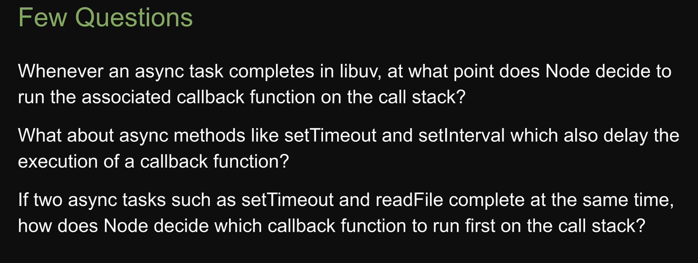

[toc]

# Event Loop

## 同步和异步

以下代码分别执行了一个异步函数以及两个同步函数：

```js
console.log("First");
fs.readFile(__filename, () => {
  console.log("Second");
});
console.log("Third");
```

执行结果为：

```
First
Third
Second
```

在 nodejs 执行环境下，异步代码交给 libuv 负责，用户的同步代码则直接放进函数栈执行，nodejs 优先执行同步代码，然后再执行异步代码。
[(可以参阅这个视频来理解)](https://www.bilibili.com/video/BV1Rw411s7wT/?p=42&share_source=copy_web&vd_source=7122811f33b9804864bfad38c3aaa539&t=200)

但是仅仅知道这些，无法回答一下几个问题：

<p align="center">
  
</p>

所以我们需要了解 libuv 内部做了什么工作


# Reference

