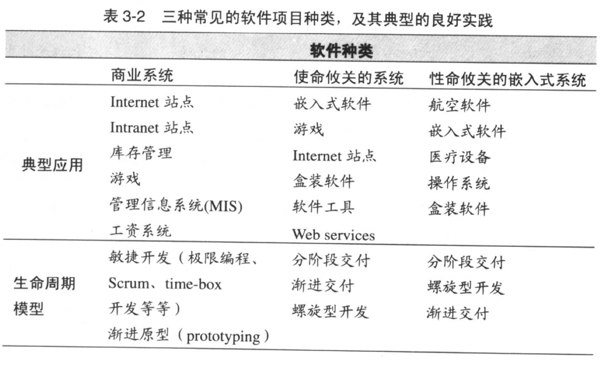
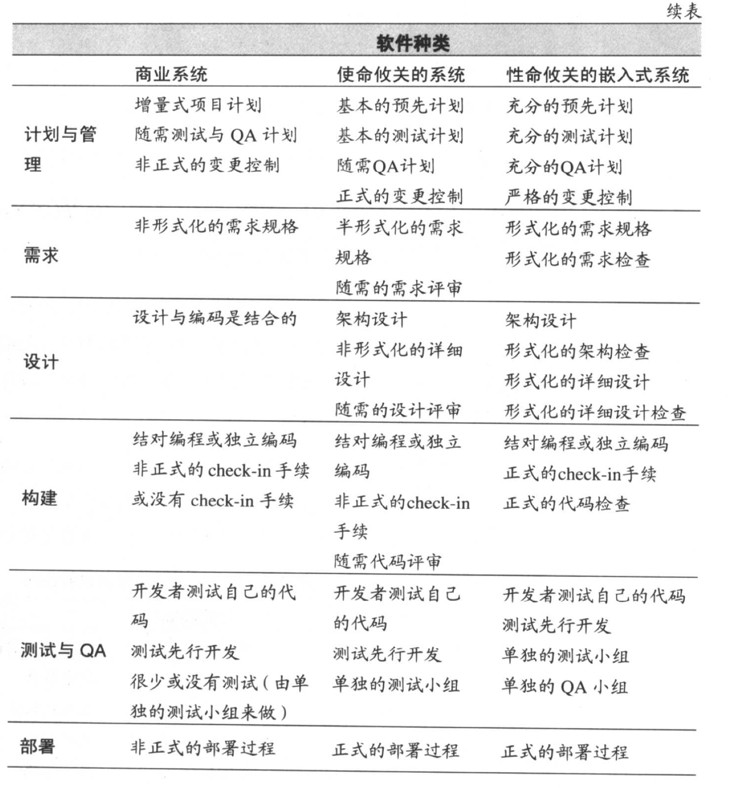
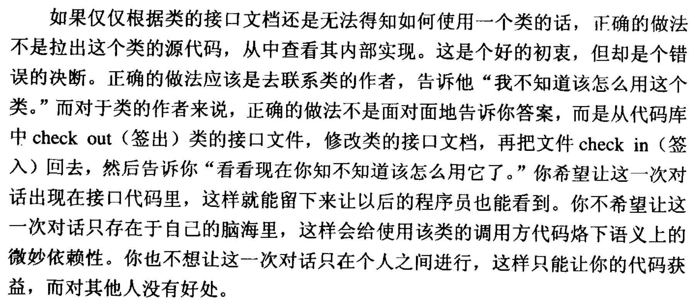

# 笔记描述

## 笔记字体颜色对应的含义

<font color="red">红色：不了解的问题</font><br>
<font color="orange">橙色：个人观点与书中观点不一致的问题</font><br>
<font style="background-color: steelblue">钢蓝色：需要注意的重点</font>

## 第一章 什么是软件构建

1. constructor 工作的细节如下：
   - 完成准备工作（定义问题，需求分析，详细设计）
   - 设计测试用例
   - 编写代码
   - 进行单测和集成测试
   - 代码评审
   - 润色代码，添加注释等
   - 各软件组件进行集成
   - 优化代码

## 第二章 用隐喻来更充分地理解软件开发

1. 敏捷开发所基于的增量式编程，结合 ICViewer 的开发过程的思考：
   - 是否应当在开始整体设计之前，先使用 assimp 库完成一个结构简单的模型读取例子（包括顶点、光照、动画、贴图）后，再进行整体结构的设计？

## 第三章 三思而后行: 前期准备

1. 不同项目使用的开发方法可以参考下面表：
<div style="text-align: center">
  
</div>
<div style="text-align: center">
  
</div>

2. 对照项目的需求核对表

3. 构建软件架构

   1. 架构应该详细定义所用的主要的类。它应该指出每个主要的类的责任，以及该类如何与其他类交互。它应该包含对类的继承体系、状态转换、对象持久化等的描述。如果系统足够大，它应该描述如何将这些类组织成一个个子系统。架构应该记述曾经考虑过的其他类设计方案，并给出选用当前的组织结构的理由。架构无须详细说明系统中的每一个类。瞄准 80/20 法则:对那些构成系统 80% 的行为的 20%的类进行详细说明 (Jacobsen, Booch, and Rumbaugh 1999; Kruchten 2000).
   2. 考虑内存的资源管理问题

4. 3.5 这一章节可作为构建软件架构的参考，都应当视为重点；章末附有核对表，可在完成架构的时核对
5. 3.6 这一章节后半部分包含有关于需求、软件架构、开发方法的一些数据文献推荐

## 第四章

1. 选择合适的编程语言
2. 构建一种合适的编程约定，并且始终遵循这个约定完成开发
3. 建立自己的语言表达体系，而不是被编程语言牵着鼻子走

## 第五章

1. 设计的主要目的在于降低软件开发带来的复杂度
2. 5.2 中设计的理想特征可以作为设计的一个参考
3. 5.3 中提到的设计的层次划分是开发中需要使用的方法，将整个项目从软件系统、子系统和包、类、数据和子程序、子程序内部这样的方式进行划分
4. 请在进行子程序/类/接口/字段的设计中，反复询问自己“我需要隐藏什么？这里是否符合信息隐藏？”，它使得使用信息隐藏的部分获得极大的灵活性以及可变性（参考 5.3 信息隐藏，id 类型部分
5. 应对变化的策略是，明确核心功能后，在设计时考虑每个模块可能的变化，再进行应对（例如错误码不应该使用 int 而是使用 enum）
6. 良好的耦合关系应当是，一个模块（类/子程序）对其他模块内部细节了解的越少越好
7. 了解一下设计模式，为 ICViewer 选择适合的设计模式进行开发
8. p108 关于启发的总结这里可以作为选择设计方式的参考，我认为比较重要的是结合自上而下和自下而上两种方式来完成设计，同时使用可以丢弃的原型代码来确认不了解的信息

## 第六章

1. 对类进行设计的目标应当在于，能够尽力写出可以忽视更多代码的结构
2. 用编程完全描述语义（例如 video.play() 必须在 video.load() 之后执行，那么需要使用 Assert 等手段，处理直接调用 video.load() 的情形）
3. 关于 assimp 中无法提取 interpolation 数据的处理办法建议 [(issue 地址)](https://github.com/assimp/assimp/issues/4890)
<div style="text-align: center">
  
</div>

4. 尽力让你的 include file 成为调用方的文档。好的封装（协议&头文件&设计）应当避免调用方在开发过程中，尝试阅读你的源代码。
5. 使你的成员变量尽可能保持在 7 $\pm$ 2 的程度（是否 $\pm$ 2，取决于成员变量是否为简单类型）
6. 如果你只是想使用一个类的实现而不是接口，那么就应该采用包含方式，而不该用继承。
7. 尝试使用继承来替代 switch case（灵活判断）
8. 行为是决定是否使用继承的关键，如有共有的行为，应当尝试使用继承，但是继承本身会增加复杂度，应当避免使用
9. 禁止隐式产生不需要的成员函数（例如默认拷贝构造等）
10. 避免间接调用其他对象的方法。例如：A 对象包含 B 对象，B 对象包含 C 对象，A 应该避免通过 B 对象间接调用 C 对象方法
11. <font color="red">问题：为什么在所有的构造函数中初始化所有的数据成员，是一种防御性编程</font>
12. <font color="orange">问题：书中不推荐浅层拷贝，原因是需要通过引用计数，然而 C++11 中已有 shared_ptr 解决这个问题，因此可能不需要手动管理</font>
13. <font color="orange">问题：书中说 C++ 不支持子类覆盖基类的同名方法，但实际上这在 C++98 都是可行的</font>（见语言问题）
14. 每一章节之后的检查表这里不再赘述

## 第七章

1. 子程序参数按照 输入——修改——输出 的顺序排列，例如 `bool GetSinAndPushToList(const double& degree, list<double>& sin_ret_list, double& sin_ret)`（这里仅做演示，事实上这个函数的功能可以分解成两个子程序，该函数的参数也可以更少）。除此以外，也可以定义更细致的参数顺序，例如：`my_memory(src, size, dest);`
2. 尽可能避免使用宏

## 第八章 防御式编程

### 保护程序免遭非法输入的破坏

```c++
void ProtectCodeFromIllegalInput(const std::string& code) {
  CheckAllExternalInputValue(code);
  CheckFunctionParameter(code);
  std::function<void> deal_error_number_code = [](){ ... };
  std::function<void> deal_error_string_code = [](){ ... };
  std::function<void> deal_error_object_code = [](){ ... };
  AddErrorDealingCode(code, deal_error_number_code,
                      deal_error_string_code,
                      deal_error_object_code);
}
```

### 断言

断言常常用于 debug，因此可以定义如下：

```c++
#include <cstdio>
#include <list>
#include <string>
struct Employee;
enum class JobType;

#define DEBUG 1
#define ASSERT_FAILED_EXIT_CODE -1

#ifdef DEBUG
#define ASSERT(bool_expr, msg, ...)                                            \
  do {                                                                         \
    if (!(bool_expr)) {                                                        \
      printf(msg);                                                             \
      std::exit(ASSERT_FAILED_EXIT_CODE);                                      \
    }                                                                          \
  } while (0)

#define LARGE_SYSTEM_ASSERT(bool_expr, msg, ...)                               \
  do {                                                                         \
    if (!(bool_expr)) {                                                        \
      printf(msg);                                                             \
    }                                                                          \
  } while (0)
#else
#define ASSERT(bool_expr, msg)
#endif

bool IsValidJobType(const JobType job);
const std::string GetJobTypeName(const JobType job);
template <typename T> bool CheckDataExtrameCase(T data) { return true; }

bool AddEmployeeInfoToList(const std::string &name, const uint32_t age,
                           const JobType job,
                           const std::list<Employee> &employee_list) {
#ifdef LARGE_SCALE_SOFTWARE
  LARGE_SYSTEM_ASSERT((!name.empty() && name.size() > 20),
                      "name size cannot large than 20!\n");
  LARGE_SYSTEM_ASSERT((age <= 65 && age >= 18),
                      "age can only between 18 and 65!\n");
  LARGE_SYSTEM_ASSERT(IsValidJobType(job), "cannot find the job %s\n",
                      GetJobTypeName(job).c_str());
  if (!(!name.empty() && name.size() > 20)) {
    printf("name size cannot large than 20!\n");
    return false;
  }
  if (!(age <= 65 && age >= 18)) {
    printf("age can only between 18 and 65!\n");
    return false;
  }
  if (!IsValidJobType(job)) {
    printf("cannot find the job %s\n", GetJobTypeName(job).c_str());
    return false;
  }
#else
  ASSERT(CheckDataExtrameCase(name), "name cannot be %s\n", name.c_str);
  ASSERT(CheckDataExtrameCase(age), "age cannot be %u\n", age);
  ASSERT(CheckDataExtrameCase(job), "job cannot be %s\n",
         GetJobTypeName(job).c_str());

  if (!(!name.empty() && name.size() > 20)) {
    printf("name size cannot large than 20!\n");
    return false;
  }
  if (!(age <= 65 && age >= 18)) {
    printf("age can only between 18 and 65!\n");
    return false;
  }
  if (!IsValidJobType(job)) {
    printf("cannot find the job %s\n", GetJobTypeName(job).c_str());
    return false;
  }
#endif
  // add data to list
  return true;
}
```

大型软件开发场景中，尽可能同时使用断言和代码判断；其他场景中，尽可能让断言处理几乎不可能发生的情况，或者不符合调用契约的情况（例如 `AddEmployeeInfoToList()` 调用的年龄不应该超过 65 岁等）。<font style="background-color: steelblue">请确保断言程序使程序中断</font>。具体情况可以灵活判断.

### 错误处理技术

ProcessErrorMethod 类型给出了不同的处理错误的方法

```c++
enum class PropertyValueType {
  kNatureValue,
  kClosetValue,
  kNextValue,
  kErrorCode
};

template <typename T> T GetNatureValue();  // 获取中立值
template <typename T> T GetClosetValue();  // 获取最接近值
template <typename T> T GetNextValue();    // 获取下一个正确值
template <typename T> T ReturnErrorCode(); // 返回适当的错误值

void WriteToFile(const std::string &msg, const std::string &path);
void WriteToConsole(const std::string &msg);

class ProcessErrorMethod {
public:
  template <typename T> T ReturnPropertyValue(const PropertyValueType type) {
    switch (type) {
    case PropertyValueType::kNatureValue: {
      return GetNatureValue<T>();
    }
    case PropertyValueType::kClosetValue: {
      return GetClosetValue<T>();
    }
    case PropertyValueType::kNextValue: {
      return GetNextValue<T>();
    }
    case PropertyValueType::kErrorCode: {
      return ReturnErrorCode<T>();
    }
    }
    return ret_value;
  }

  void LogInFile(const std::string &msg, const std::string &path) {
    WriteToFile(msg, path);
  }

  void LogInConsole(const std::string &msg) { WriteToConsole(msg); }

  inline void InnerErrorProcess(const std::function<void()> &process) {
    if (process) {
      process();
    }
  }

  inline void ExitProgram(const uint32_t exit_code) { std::exit(exit_code); }
};

```

除此之外，人身安全相关的软件应当注意正确性（即使停机也不能返回错误数据）；消费软件则需要注意健壮性（即使输出一些什么也不能停机）

### 异常

~~除了库有可能抛出异常，需要考虑之外，我没有想到任何需要引入异常的地方。加上 C++ 之父的建议是，“应对程序运行时发生的严重错误的最佳做法，有时就是释放所有已获得的资源并终止程序执行，而让用户去重新用正确的输入数据再次运行程序 (Stroustrup 1997)”。~~

[这里](https://isocpp.org/wiki/faq/exceptions#why-exceptions)举例说明了使用异常能够简化代码的例子，个人考虑使用异常时的最佳实践可能需要遵循下面几点：

1. 出现的错误能够被子程序内部处理时，不要使用异常
2. 子程序的错误不影响后续流程时，不使用异常 <font color="red">（这里可能会导致在使用异常时，出现复杂度增加的问题）</font>
3. 执行流程相关的一系列函数时，使用异常来简化对错误信息的捕获（设置多个类型的异常，在 catch 处输出错误信息的方式，要比通过 if 逐个判断强）
4. <font style="background-color: steelblue">注意，一定要在建立合理的异常使用规范之后，再遵循规范给代码添加异常，不然会增加项目的复杂度</font>

### 隔离程序层

可以理解为正式处理之前的预处理操作，例如过滤数据，修正类型，示例如下：

```cpp

#define ASSERT(expr, msg, ...)                                                 \
  do {                                                                         \
    if (!(expr)) {                                                             \
      printf(msg);                                                             \
      abort();                                                                 \
    }                                                                          \
  } while (0)

enum class ColorType { kRed, kBlue, kBlack, kDefault /* default is white */ };

ColorType GetColorTypeFromStr(const std::string &color_type);

class Circle {
public:
  Circle(const float x, const float y, const float r,
         const ColorType color_type) {}
  Circle(const float x, const float y, const float r,
         const std::string &color_type) {}

private:
  void InnerInit(const float x, const float y, const float r,
                 const ColorType color_type) {
    // validate here
    const float valided_r = (r <= 0.0f) ? 1.0f : r;
    // real init
    RealInit(x, y, valided_r, color_type);
  }
  void InnerInit(const float x, const float y, const float r,
                 const std::string &color_type) {
    // validate here
    const float valided_r = (r <= 0.0f) ? 1.0f : r;
    // real init
    const ColorType valided_color_type = GetColorTypeFromStr(color_type);
  }
  void RealInit(const float x, const float y, const float r,
                const ColorType color_type) {
    ASSERT(r <= 0, "r value is illegal!");
    x_ = x;
    y_ = y;
    r_ = r;
    color_type_ = color_type;
  }

  float x_;
  float y_;
  float r_;
  ColorType color_type_;
};

```

`ASSERT` 应当在隔离程序层之后

### 辅助调试的代码

尝试将你的项目分成开发和发行两个版本，在开发版本中加入尽可能多的辅助性代码，这样可以更好的对项目的健壮性进行评估，同时，也可以降低 Debug 代码所需要的时间。

1. 对于辅助调试/测试性能/测试健壮性的代码，可以使用 cmake 或者 stub 的方式；
2. 测试时，最好选用攻击性较强的测试 case，以便更好的验证代码的健壮性，及时发现代码的不足之处。一些建议可以参考“采用进攻式编程”这一节。

```cpp
class MemoryPool;

class AssistantModule {
public:
  class AssistantDebugModel {
    void AddDebugStub(const std::string &code) {}
    void RemoveDebugStub(const std::string &code) {}
  };

  class AssistantTestModel {
    // 采用进攻式策略测试开发代码
    // 尝试在合理范围内“攻击”你的代码
    void WriteFileUntilLimit(const std::string &file) {}
    void RunOutOffMemoryPool(MemoryPool &pool) {}
    // ...
  };

private:
  AssistantDebugModel debug_model_;
  AssistantTestModel test_model_;
};
```

### 确定在产品代码中该保留多少防御式代码

这章作为参考，基本没有需要非常注意的事项

## 第三部分 变量（9 ～ 13 章节）

> 这部分偏向于基本知识介绍，这里不做重点记录，阅读上也以浏览为主

1. 使用内存检测工具来检查是否存在未释放的指针等内存问题
2. 尽可能减少对象存在的生命周期
3. 避免使用具有隐含含义的变量（例如 age = -1 表示年龄未指定）

## 第四部分 语句（14 ～ 19 章节）

> 这部分偏向于基本知识介绍，这里不做重点记录，阅读上也以浏览为主

1. 子程序的明明需要揭示依赖关系，ICViewer 中的 GetVerticesData 必须是最后一个执行这里让人困惑，需要重新考虑
2. if-else 要有一个规范，例如，将预期的运行放在 if 中，在 else 中处理异常情况。这样之后，阅读代码就容易找到正确的链路。
3. switch-case 中，建议使用 default 来处理错误情况，在 case 中记录所有的类型。
4. while 循环中，避免在循环外部和循环内部使用相同的语句，这样会导致后期变更时，难以同时注意到两方，提高 bug 出现的概率。
5. 构建任何循环时，应当将循环内部视作黑盒，用循环判断条件，注释等循环外部方式告知代码阅读者这段代码的作用
6. 如无必要，请慎重使用 break 和 continue。使用 break 和 continue 与第五条规则冲突，因为 break 和 continue 迫使阅读代码的人需要深入循环细节
7. 在使用多个 else if 的情况下，不妨考虑一下表驱动
8. 使用 if 表达式时，if 语句内尽量编写编写肯定形式的布尔表达式
9. 用狄摩根定理简化否定的布尔判断，例如 `(A or B)` 等价于 `not (not A and not B)`, 算法很简单:

```cpp
// if has 'not', remove 'not'
// if no 'not', add 'not'
std::string ReverseNotOfExpr(const std::string &expr) {
  std::string expr_ret = expr;
  if (expr.find("not") != std::string::npos) {
    // if find not, remove
    std::string::size_type idx = expr.find("not");
    expr_ret = expr_ret.substr(idx + 3);
  } else {
    // else, add not
    expr_ret = "not " + expr_ret;
  }
  return expr_ret;
}

std::string ConvertToNotExpr(const std::string &expr_a,
                             const std::string &operation,
                             const std::string &expr_b) {
  std::string expr_a_ret = ReverseNotOfExpr(expr_a);
  std::string expr_b_ret = ReverseNotOfExpr(expr_b);
  std::string operation_ret = operation;
  if (operation_ret.find("and") != std::string::npos) {
    operation_ret = " or ";
  } else if (operation_ret.find("or") != std::string::npos) {
    operation_ret = " and ";
  } else {
    std::cout << "unknown operation\n";
    return "";
  }
  return "not (" + expr_a_ret + operation_ret + expr_b_ret + ")";
}
```

not 提出来之后，反转括号内的 and/or 和 NONE/not

10. 可以通过 Tom McCabe 提供的复杂度衡量方式，来评估是否需要对代码进行简化改进。通过评估 if while repeat for and or “决策点”的数量来确定是否需要简化代码：
    | 决策点 | 评估结论 |
    | ------- | -------------------------------------------------- |
    | 0 ～ 5 | 代码可能还行 |
    | 6 ～ 10 | 代码可能需要进行简化 |
    | 10+ | 将子程序的一部分分解成第二个子程序，并从第一个调用 |

## 第 20 章

1. 需要根据下面的 class 来制定软件质量的评估目标

```cpp
class SoftwareQuality {
public:
  class ExternalQuality {
    double CorrectnessEvaluation(
        const std::string &code) /* 软件能够按照预期的功能正确运行 */ {
      return 1.0;
    }
    double UsablityEvaluation(const std::string &code) { return 1.0; }
    double EffeciencyEvaluation(const std::string &code) { return 1.0; }
    double ReliabilityEvaluation(const std::string &code) { return 1.0; }
    double IntegrityEvaluation(const std::string &code) {
      // keep out those access which hasn't been authorized
      // make use all data can be accessed properly
      return 1.0f;
    }
    double AdaptabilityEvaluation(const std::string &code) { return 1.0; }
    double AccuracyEvaluation(
        const std::string &code) /* 软件输出的数据误差小于某个范围 */ {
      return 1.0;
    }
    double RoubustEvaluation(const std::string &code) { return 1.0; }
  };
  class InternalQuality {
    double MaintainabilityEvaluation(const std::string &code) { return 1.0; }
    double FlexibilityEvaluation(const std::string &code) { return 1.0; }
    double ProtabilityEvaluation(const std::string &code) /* 可移植性 */ {
      return 1.0;
    }
    double ReusabilityEvaluation(const std::string &code) { return 1.0; }
    double ReadabliltyEvaluation(const std::string &code) { return 1.0; }
    double TestabilityEvaluation(const std::string &code) { return 1.0; }
    double UnderstandabilityEvaluation(const std::string &code) { return 1.0; }
  };

private:
  ExternalQuality external_quality_;
  InternalQuality internal_quality_;
};
```

2. 进行阶段性的技术评审用来保证之前的代码质量
3. 不应当将测试作为最为重要的质量保证方式，通过测试，发现并解决缺陷的收益成本比最低；相反，对架构、系统关键部分以及代码本身进行评审，发现并解决缺陷的收益成本比最高。因此，多人参与的（强调多人参与是因为多人能够在评审时提供不同的视角）项目评审是非常重要的。

## 第 21 章

1. 这章内容没有仔细阅读，总体感觉在介绍多人参与场景下（结对编程、非正式/正式评审下），发现缺陷的概率会极大提升，我认为后续工作中，如果有团队开发的项目，这个章节应该能作为一个很好的参考，但是目前看的我昏昏欲睡

## 第 22 章

1. 应该按照顺序对软件开发的成果进行测试：

```cpp

template <typename T> class TestTool {
public:
  void UnitTest(const T &tested_obj) {}
  void ComponentTest(const T &tested_obj) {}
  void IntegrationTest(const T &tested_obj) {}
  void RegressionTest(const T &tested_obj) {}
  void SystemTest(const T &tested_obj) {}
};

class BlackBoxTest {
private:
  // void * is the function pointer
  TestTool<std::vector<void *>> black_test_tool_;
};

class WhiteBoxTest {
public:
  TestTool<const std::string &> white_box_test_;
};

```

当然，总体的测试按照是否知晓实现细节，分为黑盒测试和白盒测试（分别表示不知晓，和知晓）

2. 正如 “辅助调试代码” 那一节所述，试图使用一些能够攻击你代码的测试 case
3. 文中虽然列举了很多测试的启发式方式，但我觉得按照以下两种方式进行测试就足够了：
   - 结构化测试（对 while，for，if，switch-case 的每个结构进行单独的测试用例编写）
   - 数据流测试（主要是范围，考虑数据表示范围，语义上的数据范围）
4. 测试支持工具中列举了一些测试方式，但是对于 ICViewer 没有特别有意义的参考价值，这里就不列举了，如果后续有对应项目需要，可以参考
5. 之后的项目，在设计软件架构的同时，也需要做一份测试架构设计，同时需要做一份留存错误的系统。以此保证每次错误得到记录，并用于下一次测试系统的编写。关于错误记录的方式，可以参考“维护测试记录”这一章节。

## 第 23 章 调试

1. 找出问题的根源，这个根源必须是可以复现的
2. 思考项目其他部分是否还存在类似的问题

## 第 24 章 重构

1. 重构之前，核对“检查清单：重构的理由”来确认项目是否需要重构

## 第 25 章 代码调优策略

1. 对项目的调优策略可以不仅限于代码层面，对于不同需求，处于不同时期下的项目，可尝试采用的策略如下：
   - 程序需求（是否真的需要对某个子程序进行调优呢？）
   - 程序设计（子程序的设计是否是最优的？）
   - 子程序和类
   - 操作系统交互（代码是否对操作系统 API 有调用呢？）
   - 代码编译（是否可以使用能生成更佳执行效率的编译器呢？）
   - 硬件（是否可以要求购买更好的硬件呢？）
   - 代码调优（本章节的主题）
2. 建立一条质量评估系统很重要，这意味着它在支持程序运行的不同环境中，能给出指导优化的方向
3. 代码中出现的效率问题，对我而言，以下几种情况出现的概率会比较大：
   - 代码导致内存频繁访问硬盘上的数据（例如按最远距离遍历一个二维数组）
   - 某些系统调用的开销很大
   - Release 版本中，没有开启编译器优化选项
   - 代码中仍然存在一些错误，例如指针没有释放，没有去掉调试代码等等
4. 在使用 “表 25-2 常见操作的开销” 时，需要思考目标的 CPU 是否在硬件层面存在对应的指令来执行该操作，并制作一张对应的表格来参考
5. 进行运行时间的度量时，选择系统分配给你的时钟 tick，而不是限时时间，避免被系统调度所影响（ICViewer 的 while 循环等待时间除外）

## 第 26 章 代码调优技术

1. 循环可采用如下策略：
   - 循环内展开，例如将 `for(;;) { a[i] = i++; } ` 变为 `for(;;) { a[i] = i++; a[i] = i++ }`。通过降低循环次数达到提高效率的目的。
   - 利用哨兵值，降低循环判断次数 例如 `while(!found && (i < count)) { if(arr[i++] == 12) {found = true;} }` 可以修改为 `arr[count+1] = 12; while(arr[i]!=12) {i++;}`
   - 最忙的循环放在内部，例如 `for(;/* i loop 100 */;) {for(;/* j loop 5 */;) { arr[i][j] = 12; }}`，总共循环次数为 `100 + 5*100 = 600`，而如果反转内外循环，则只需要 `5+500 = 505`
2. 通过预计算达到降低运行时间的目的：例如子程序可以通过打表完成，例如计算 $log_{2}(x)$，当需要计算整数值，并且 x 为 uint32_t 时，列举出所有的可能仅需要 30 行代码，写成 if 语句也不会占用多少空间。不过如果不确定传入的变量类型，在确定是整型的情况下，或许使用右移操作比较合适。
3. 必要时刻使用分析器来对调优后的代码进行分析。

## 第 27 章 软件项目对构建的影响

1. 本章主要描述了不同软件规模下，对代码出错量、软件工程涉及的各种活动所需要的时间等内容进行了阐述

## 第 28 章 管理构建

1. 为项目选择良好的编程实践
2. 对于项目的变更（新增需求或修改原有需求）进行管理（评审、追踪）
3. <font color="red">对于构建工作量和时间的预估，本节也只是给出了发生在构建活动中难以度量的子活动，这章需要阅读更多资源来预估项目的完成时间</font>
4. 度量项目的各个细节是一个强软工管理的事情，对我来说目前很难有精力进行这个事项
5. 进行开发工作时，工作环境需要宽敞，安静，不被打断

## 第 29 章 集成

1. 增量开发一般要比其他方法好一些，出了能够过早地暴露出一些问题外，同时降低了新代码并入系统后，纠错，测试的成本
2. 每日构建的优点是能够在构建失败时，及时发现问题，定位问题，并解决问题。同时也能让一些隐性问题在更早期的阶段暴露出来
3. 每日集成也是作者推荐的方法，不过个人觉得这个方式有点压力过大，在进行难度较大的开发工作时，往往很容易无法每日同步工作进度，所以这个方式因人而异吧

## 第 30 章 编程工具

1. CASE（计算机辅助软件工程）软件可能已经过时[（参考这里）](https://www.zhihu.com/question/395387352)，但和其他人交流时可能还会遇到需要抽象表达的地方，以防万一还是尽可能了解一些
2. 必要时可以尝试使用 类继承层次生成器 来分析代码结构
3. 通过 指标报告工具 可以一定程度上检测代码的复杂度，不知道 C++ 有没有类似的工具
4. 找找 C++ 的重构工具
5. 性能优化时候可以尝试使用 执行性能剖测器

## 第 31 章 代码布局和风格

1. 本章在现在已经不具有太多参考价值，vscode 等各种代码编辑器和 ide 已经包含了太多的 code formatter

## 第 32 章 自文档代码

1. 如果某块代码在修改或者使用时需要特别小心，请尽可能用“改的好用”而不是“详细注解”来解决这个问题。
2. 在不使用 Doxygen 这种注释转文档的技术下，可以尝试使用“程序文档的书籍范式”来增加可维护性（不过这已经是一项古早技术了）
3. 如果实在不知道使用什么样的规范作为指导，可以参考书中的 IEEE 系列指南（32.6 节）

## 第 33 章 个人性格

1. 粗略阅读了一下，描述了个人性格在编程中起到的作用，后续再翻一翻吧

## 第 34 章 软件开发艺术有关的问题

1. 粗略阅读了一下，标题足够好的概括内容了（废话），需要时再翻翻吧

## 第 35 章 何处有更多信息

1. 半数网站已经失效，但是 ACM，IEEE 这些还在，非常具有参考价值
2. Construx Software 提供的课程并不免费，截至目前没有查询到有关它的一些评价

# 语言问题

1. <font color="orange">问题：书中第六章说 C++ 不支持子类覆盖基类的同名方法，但实际上这在 C++98 都是可行的</font>
   这个问题混淆了 C++ 中 hide 和 override 的概念，下面有个例子能清晰的说明它们的区别：

```c++
#include <iostream>
class Basic {
public:
  void foo(int a) { std::cout << "call foo(int) in Basic\n"; }
  void foo(char *s) { std::cout << "call foo(char *) in Basic\n"; }
};

class Derived : public Basic {
public:
  void foo(int a) { std::cout << "call foo(int) in Derived\n"; }
};

int main() {
  Basic basic;
  Derived derived;
  basic.foo(1);
  basic.foo(nullptr);
  derived.foo(1);
  // derived.foo(nullptr); // error
  return 0;
}
```

由于 Derived 中隐藏了 Basic 的 foo，所以 Basic 的所有 foo 函数对 Derived 来说都是不可见的，因此这里无法调用到 `foo(char*)`。
但是在 java 中可以这样做：

```java
public class Main
{
    public static void main (String []agrs){
        Basic basic= new Basic();
        Derived derived= new Derived();
        basic.foo();
        basic.foo("basic");
        derived.foo();
        derived.foo("derived");
    }
}
class Basic {
    void foo() {
        System.out.println("call foo() in Basic.");
    }
    void foo(String someStr) {
        System.out.println("call foo(String) in Basic.");
    }
}
class Derived extends Basic {
    void foo() {
        System.out.println("call foo() in Derived.");
    }
}
```

由于 java 中的 Derived 覆盖了 Basic 的 `foo()`，而不是隐藏了 Basic 中的 `foo`，所以 Basic 中的 `foo(String)` 仍然对 Derived 可见，因此可以通过 Derived 调用到 Basic 的 `foo(String)`

2. 纪念版 605 页表格 25-2 中，为什么 C++ 中，整数除法会占用 5 个基准量？（参考回答：https://stackoverflow.com/questions/21819682/is-integer-multiplication-really-done-at-the-same-speed-as-addition-on-a-modern?noredirect=1&lq=1，我觉得我需要补充一点查找硬件信息的知识了）
   答：从 stackoverflow 上看，即使是 20 年的 ARM 处理器，乘法的效率仍然平均低于加法。
