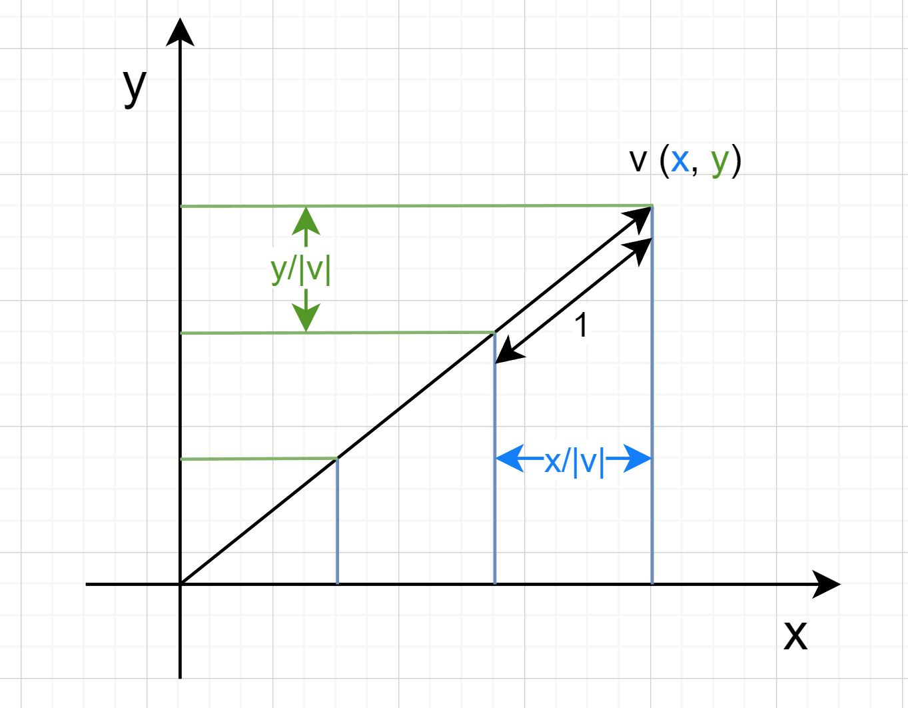

# Basic

## 单位向量

### 公式

有向量 $\vec{v}=(x,y)$，其模长 $|\vec{v}| = \sqrt{x^2+y^2}$，则单位向量 $\vec{e}=(\frac{x}{|\vec{v}|},\frac{y}{|\vec{v}|})$

### 几何解释

如上图所示，$\vec{v}$ 方向上的单位向量的模长为 1 时，集合上是将 $|\vec{v}|$ 分成了 $|\vec{v}|$ 份，每份为 1。那么对于 $\vec{v}$ 的 x，y 轴，进行同样的分割，即 $\vec{e}=(\frac{x}{|\vec{v}|},\frac{y}{|\vec{v}|})$

## 正交投影(Orthogonal Projection)

### 公式

有向量 $\vec{u} = (u_x, u_y)$ 以及向量 $\vec{v} = (v_x, v_y)$，向量 $\vec{u}$ 在向量 $\vec{v}$ 上的投影为向量 $\vec{p}$，向量 $\vec{u}$ 和向量 $\vec{v}$ 的夹角为 $\theta$

### 推导：

由上图可得：
$$|\vec{p}| = |\vec{u}|cos\theta$$
根据余弦定理：
$$\vec{v}\cdot \vec{u} = |\vec{v}| |\vec{u}| cos\theta $$
可得：

$$
\begin{align}
|\vec{p}| &= |\vec{u}|cos\theta\\
&=\frac{\vec{v}\cdot \vec{u}}{|\vec{v}|}
\end{align}
$$

因为 $\vec{p} = |\vec{p}| * \frac{\vec{v}}{|\vec{v}|}$，故可得：

$$
\begin{align}
\vec{p} &= |\vec{p}|* \frac{\vec{v}}{|\vec{v}|}\\
&= \frac{\vec{v}\cdot \vec{u}}{|\vec{v}|} * \frac{\vec{v}}{|\vec{v}|}\\
&= \frac{\vec{u}\cdot \vec{v}}{|\vec{v}||\vec{v}|} * \vec{v}\\
&= \frac{\vec{u}\cdot \vec{v}}{\vec{v}\cdot\vec{v}} * \vec{v}
\end{align}
$$
