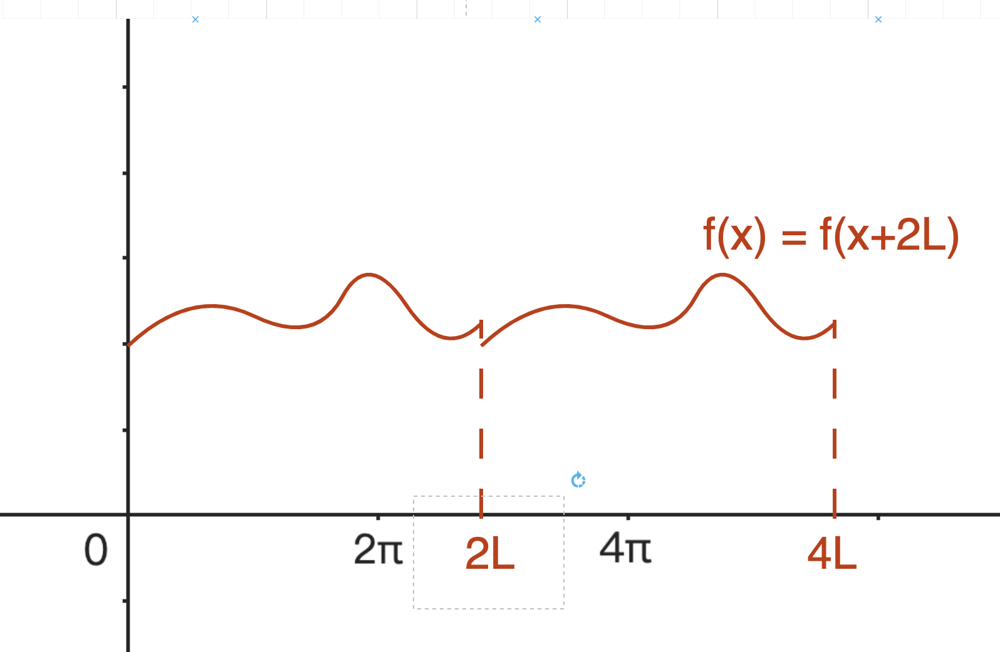
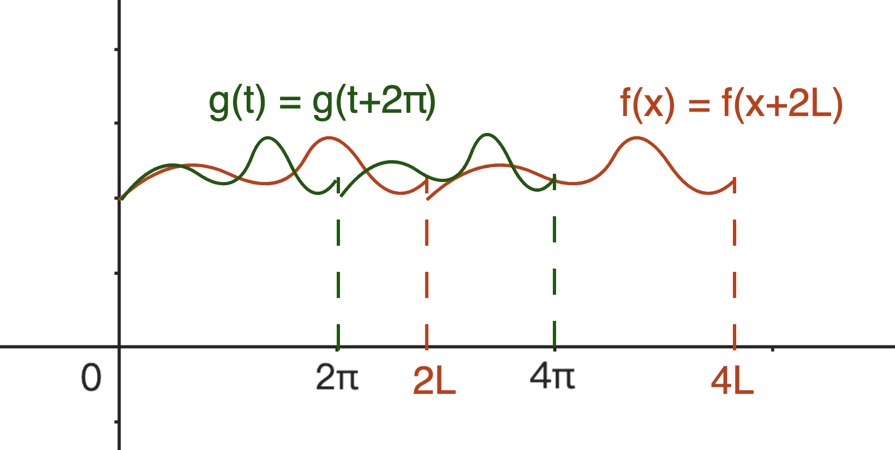

[toc]

# 傅立叶级数的一般形式

我们在 [傅立叶级数的 $2\pi$ 形式](./2pi_form.md) 中求解了周期为 $[-\pi,\pi]$ 的周期函数，其傅立叶级数的展开形式。这里我们探讨更一般的情形，是否可以对任意周期的周期函数，进行傅立叶级数的展开呢？

答案是肯定的，既然是周期函数，那么它一定存在一个周期 T，使得 $f(x)=f(x+T)$；我们只需要将这个周期“变换”到 $2\pi$，就可以使用之前的结论了。

## 1. 将周期“变换”到 $2\pi$

我们现在有一个周期为 $2L$ 的函数 $f(x)=f(x+2L)$，它的部分图像如下图所示：

我们目前的傅立叶级数公式需要函数的周期为 $2\pi$，那么我们需要把当前这个函数变换到 $2\pi$ 区间上去。我们要做的变换结果如下图所示：

$g(t)=g(t+2\pi)$ 就是我们想要的，变换之后的函数。

那么如何完成这个变换呢？
两个函数在自变量的“数量”上相同，而在自变量的“变化量”上不同：

$$
\begin{cases}
t=n\Delta t \iff n=\frac{t}{\Delta t}\\
x=n\Delta x \iff n=\frac{x}{\Delta x}\\
\end{cases}
$$

如果我们想要将 $f(x)$ 变换到 $g(t)$ 上，就需要将 $x$ 变换到 $t$，换句话说就是用 $x$ 表示 $t$

$$
\begin{align}
t &= n\Delta t\\
&= \frac{x}{\Delta x} \Delta t\\
&= \frac{\Delta t}{\Delta x}x\\
\end{align}
$$

这里 $\frac{\Delta t}{\Delta x}$ 可以借助各自的周期来计算：

$$
\begin{cases}
2\pi = m\Delta t\\
2L = m\Delta x\\
\end{cases}
$$

所以

$$
\begin{align}
\frac{\Delta t}{\Delta x} &= \frac{2\pi}{2L}\\
&= \frac{\pi}{L}\\
\end{align}
$$

所以
$$t = \frac{\pi}{L}x$$

## 2. 周期为 2L 的傅立叶级数

有了上面这个结论之后，我们就可以着手推导任意周期的傅立叶级数了。

我们再回顾一下周期为 $2\pi$ 的傅立叶级数：

$$
\begin{align}
&g(t)=c_0 + \sum^{\infty}_{n=1}a_ncos(nt) + \sum^{\infty}_{n=1}b_nsin(nt)\\
&\begin{cases}
a_n = \frac{1}{\pi}\int_{-\pi}^{\pi}f(t)\cdot cos(nt)dt\\
b_n=\frac{1}{\pi}\int_{-\pi}^{\pi}f(t)\cdot sin(nt)dt\\
c_0=\frac{1}{2}a_0
\end{cases}
\end{align}
$$

我们将 $t = \frac{\pi}{L}x$ 以及 $c_0$ 代入。

$$
\begin{align}
g(t)&=c_0 + \sum^{\infty}_{n=1}a_ncos(nt) + \sum^{\infty}_{n=1}b_nsin(nt)\\
g(x)&=\frac{a_0}{2} + \sum^{\infty}_{n=1}a_ncos(n\cdot \frac{\pi}{L}\cdot x) + \sum^{\infty}_{n=1}b_nsin(n\cdot \frac{\pi}{L}\cdot x)
\end{align}
$$

由于 $\omega=\frac{2\pi}{T}$，这里 $T = 2L$，因此在这个情形下，$\omega=\frac{\pi}{L}$，因此

$$
\begin{align}
g(x)&=\frac{a_0}{2} + \sum^{\infty}_{n=1}a_ncos(n\cdot \frac{\pi}{L}\cdot x) + \sum^{\infty}_{n=1}b_nsin(n\cdot \frac{\pi}{L}\cdot x)\\
g(x)&=\frac{a_0}{2} + \sum^{\infty}_{n=1}a_ncos(n\omega x) + \sum^{\infty}_{n=1}b_nsin(n\omega x)
\end{align}
$$

我们接着来计算 $a_n$，将 $t = \frac{\pi}{L}x$ 代入。由于被积分的变量发生了变化，所以我们需要修改一下积分的上下限：

$$
\begin{cases}
\pi = \frac{\pi}{L}x \iff x=L\\
-\pi = \frac{\pi}{L}x \iff x=-L
\end{cases}
$$

因此上下限分别是 $L$ 和 $-L$：

$$
\begin{align}
a_n &= \frac{1}{\pi}\int_{-\pi}^{\pi}f(t)\cdot cos(nt)dt\\
&= \frac{1}{\pi}\int_{-L}^{L}g(x)\cdot cos(n\frac{\pi}{L}x)d(\frac{\pi}{L}x)\\
&= \frac{1}{\pi}\cdot\frac{\pi}{L}\int_{-L}^{L}g(x)\cdot cos(n\omega x)dx\\
&= \frac{1}{L}\int_{-L}^{L}g(x)\cdot cos(n\omega x)dx\\
\end{align}
$$

$b_n$ 的情形是类似的：

$$
\begin{align}
b_n&=\frac{1}{\pi}\int_{-\pi}^{\pi}f(t)\cdot sin(nt)dt\\
&=\frac{1}{\pi}\int_{-L}^{L}g(t)\cdot sin(n\frac{\pi}{L}x)d(\frac{\pi}{L}x)\\
&=\frac{1}{\pi}\cdot\frac{\pi}{L}\int_{-L}^{L}g(x)\cdot sin(n\omega x)dx\\
&=\frac{1}{L}\int_{-L}^{L}g(x)\cdot sin(n\omega x)dx\\
\end{align}
$$

因此对于周期为 2L 的函数 $g(x)$，其傅立叶级数展开式为：

$$
\begin{align}
&g(x)=\frac{a_0}{2} + \sum^{\infty}_{n=1}a_ncos(n\omega x) + \sum^{\infty}_{n=1}b_nsin(n\omega x)\\
&\begin{cases}
a_n=\frac{1}{L}\int_{-L}^{L}g(x)\cdot cos(n\omega x)dx\\
b_n=\frac{1}{L}\int_{-L}^{L}g(x)\cdot sin(n\omega x)dx
\end{cases}
\end{align}
$$

## 3. 傅立叶级数的一般表达式

之前我们推导了周期为 $2L$ 的函数 $g(x)$ 的傅立叶级数展开式：

$$
\begin{align}
&g(x)=\frac{a_0}{2} + \sum^{\infty}_{n=1}a_ncos(n\omega x) + \sum^{\infty}_{n=1}b_nsin(n\omega x)\\
&\begin{cases}
a_n=\frac{1}{L}\int_{-L}^{L}g(x)\cdot cos(n\omega x)dx\\
b_n=\frac{1}{L}\int_{-L}^{L}g(x)\cdot sin(n\omega x)dx
\end{cases}
\end{align}
$$

这个公式在实际应用中还有两个限制条件：

1. 往往工程可能并不会出现复数，因此积分中的 $-L$ 需要被替换
2. $L$ 还不够通用，应当使用 $T$ 来替换

所以，我们对公式进行一下变换，对于周期为 $2L$ 的函数 $g(x)$，有：

$$
\int_{-L}^{L}g(x)dx = \int_{0}^{2L}g(x)dx
$$

由于 $g(x)$ 的周期为 $T = 2L$，所以上式变为：

$$
\int_{0}^{2L}g(x)dx = \int_{0}^{T}g(x)dx
$$

同样的我们将公式中的其他 $L$ 替换为 $T$，将 $\frac{1}{L} = \frac{2}{T}$ 代入，同时我们使用 $f(x)$ 替换 $g(x)$，最后得到：

$$
\begin{align}
&f(x)=\frac{a_0}{2} + \sum^{\infty}_{n=1}a_ncos(n\omega x) + \sum^{\infty}_{n=1}b_nsin(n\omega x)\\
&\begin{cases}
a_n=\frac{2}{T}\int_{0}^{T}f(x)\cdot cos(n\omega x)dx\\
b_n=\frac{2}{T}\int_{0}^{T}f(x)\cdot sin(n\omega x)dx
\end{cases}
\end{align}
$$
